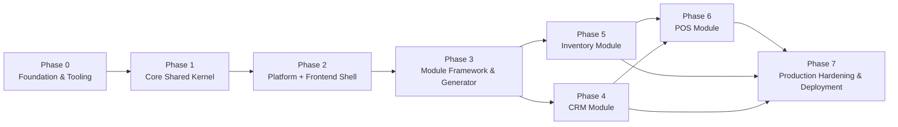

# ModuBiz — Master Development Plan

**Status:** Living document. Version 1.0. **Purpose:** A detailed, step-by-step
roadmap from an empty repository to a production-ready multi-tenant modular SaaS
ERP.

> **Read first:** [AGENTS.md](./AGENTS.md) (hard rules) ·
> [docs/PRD.md](./docs/PRD.md) (scope) ·
> [docs/ARCHITECTURE.md](./docs/ARCHITECTURE.md) (structure) ·
> [docs/TECH_STACK.md](./docs/TECH_STACK.md) (locked stack) **Companion
> guides:** [docs/CODE_QUALITY.md](./docs/CODE_QUALITY.md) ·
> [docs/UI_UX_GUIDELINES.md](./docs/UI_UX_GUIDELINES.md)

---

## How to use this plan

1. **Phases are sequential.** Each phase's exit criteria must be fully met
   before the next begins. The plan is designed so that the **core system and
   module framework are built and professionally tested before any business
   module is added** — this is what makes adding modules cheap and safe.
2. **Every step cites the governing document.** When a step says "follow
   [DATA_MODEL.md §2](./docs/DATA_MODEL.md#2-the-rls-pattern-copy-this-exactly)",
   that document is the law; this plan only orchestrates _when_ to apply it.
3. **Every testing step cites rule IDs** from
   [BUSINESS_RULES.md](./docs/BUSINESS_RULES.md). A rule without a test is a
   defect.
4. **The Definition of Done (DoD)** for each phase is a checklist. Copy it into
   the phase's tracking issue.
5. **Commit format:** Conventional Commits with a module/phase scope —
   `feat(core): add TransactionManager with RLS binding` (see
   [CODING_STANDARDS.md §13](./docs/CODING_STANDARDS.md#13-git-and-pull-requests)).

---

## Plan at a glance



| Phase | Goal                                           | Duration estimate | Exit criterion                                                                   |
| ----- | ---------------------------------------------- | ----------------- | -------------------------------------------------------------------------------- |
| 0     | Runnable monorepo with all quality gates green | 1 week            | `pnpm install && pnpm lint && pnpm typecheck` pass on an empty workspace         |
| 1     | Core shared kernel with full test coverage     | 3–4 weeks         | All `core/` unit + integration tests green; RLS proven by isolation tests        |
| 2     | Platform capabilities + frontend shell         | 3–4 weeks         | A user can sign up, create an org, log in, manage members, enable a module trial |
| 3     | Module framework + generator                   | 1–2 weeks         | `pnpm generate:module demo` produces a valid module with zero `core/` changes    |
| 4     | CRM module (full stack)                        | 2–3 weeks         | CRM DoD checklist complete; all CRM-* rules tested                               |
| 5     | Inventory module (full stack)                  | 3–4 weeks         | Inventory DoD complete; `InventoryStockPort` provided; INV-* rules tested        |
| 6     | POS module (full stack, offline-first PWA)     | 4–5 weeks         | POS DoD complete; offline sync proven; POS-* rules tested                        |
| 7     | Production hardening & deployment              | 2–3 weeks         | v1.0 deployed to production; all NFRs verified                                   |

**Total estimate:** 19–26 weeks (one developer). Parallelization on phases 4–5
can reduce this.

---

## Phase 0 — Foundation & Tooling

**Goal:** A runnable monorepo with the full toolchain, CI/CD scaffolding, and
quality gates in place — before a single line of business code is written.

**Prerequisites:** Node.js 22 LTS, pnpm ≥ 9, Docker, a GitHub repository.

### 0.1 Initialize the monorepo

1. Create `pnpm-workspace.yaml` with `apps/*` and `packages/*` globs.
2. Create root `package.json` with workspace scripts (see
   [AGENTS.md §6](./AGENTS.md#6-commands)):
   - `dev`, `lint`, `typecheck`, `test`, `test:integration`, `test:arch`,
     `test:e2e`
   - `docker:up`, `docker:down`, `db:migrate`, `db:seed`
   - `generate:module`, `generate:api-client`
3. Create `turbo.json` with the task graph: `build`, `lint`, `typecheck`, `test`
   — each with `dependsOn` and `outputs` configured.
4. Create `.nvmrc` pinning Node 22 LTS.
5. Create `docker-compose.yml` with Postgres 16 and Redis 7 services (see
   [TECH_STACK.md §6](./docs/TECH_STACK.md#6-local-development)).

### 0.2 Create shared package skeletons

Create every package from
[ARCHITECTURE.md §2](./docs/ARCHITECTURE.md#2-repository-layout) as a minimal,
importable package:

| Package                  | Initial contents                                                                                                 |
| ------------------------ | ---------------------------------------------------------------------------------------------------------------- |
| `packages/tsconfig`      | `base.json` with the non-negotiable flags from [CODING_STANDARDS.md §1](./docs/CODING_STANDARDS.md#1-typescript) |
| `packages/eslint-config` | Flat config with boundary rules, RTL rules, `no-restricted-imports` zones                                        |
| `packages/config`        | Zod env schema + `ConfigService` (the only place reading `process.env`)                                          |
| `packages/contracts`     | Empty barrel + `module.ts` with `defineModule()` placeholder                                                     |
| `packages/db`            | Drizzle config, migration runner stub, RLS helper stubs                                                          |
| `packages/money`         | Empty `Money` class stub                                                                                         |
| `packages/i18n`          | Empty locale catalog structure for `en`, `ar`, `fr`, `es`                                                        |
| `packages/ui`            | shadcn/ui setup with Tailwind config (logical properties only)                                                   |
| `packages/api-client`    | Empty (will be generated)                                                                                        |

### 0.3 Create app skeletons

1. **`apps/api`** — NestJS 11 with Fastify adapter, `main.ts`, `app.module.ts`
   (empty composition root), `core/` and `platform/` and `modules/` directories.
2. **`apps/web`** — Next.js 15 App Router with Tailwind, `next-intl` configured
   for `[locale]` routing, `@modubiz/ui` wired.

### 0.4 Set up quality tooling

1. **ESLint** flat config extending `@modubiz/eslint-config` — with:
   - `no-restricted-imports` zones enforcing the
     [import legality matrix](./docs/ARCHITECTURE.md#import-legality-matrix)
   - Tailwind RTL rule banning `ml-*`, `mr-*`, `left-*`, `right-*`, `text-left`,
     `text-right`
   - `no-console`, `no-floating-promises`, `no-unsafe-assignment`
2. **Prettier** with the project format.
3. **Husky** + **lint-staged** + **commitlint** — pre-commit runs lint+format on
   staged files; commit message enforced.
4. **Vitest** workspace config with coverage thresholds from
   [TESTING.md §2](./docs/TESTING.md#2-coverage-requirements).
5. **dependency-cruiser** config encoding the architecture boundary rules from
   [TESTING.md §5](./docs/TESTING.md#5-architecture-boundary-tests).

### 0.5 Set up CI/CD

1. **GitHub Actions** workflow `.github/workflows/ci.yml` implementing the
   pipeline from
   [TESTING.md §8](./docs/TESTING.md#8-ci-pipeline-and-merge-gates):
   - Install (`--frozen-lockfile`) → Lint+Format → Typecheck → Architecture
     tests → Unit tests → Integration+isolation tests → Build → E2E smoke →
     Security scan → Coverage gates
2. **Dependabot** grouped weekly PRs.
3. **gitleaks** secret scanning step.
4. **Docker** multi-stage build files for `apps/api` (distroless runtime) — not
   yet used, but scaffolded.

### 0.6 Create `.env.example`

Exhaustive, in sync with
[TECH_STACK.md §5](./docs/TECH_STACK.md#5-environment-variables). The app must
refuse to start if validation fails.

### 0.7 Write the first architecture test

Even with no modules, the architecture test suite must pass (vacuously true for
modules, but `process.env` and `core/` boundary checks are already meaningful).

### Phase 0 — Definition of Done

- [ ] `pnpm install` succeeds with a committed `pnpm-lock.yaml`
- [ ] `pnpm lint && pnpm typecheck` pass on the empty workspace
- [ ] `pnpm docker:up` starts Postgres + Redis
- [ ] `pnpm test:arch` passes (boundary rules are in place)
- [ ] CI pipeline runs green on a pull request
- [ ] `.env.example` is exhaustive and validated by `packages/config`
- [ ] Commitlint, Husky, lint-staged are active
- [ ] All packages are importable (no broken barrels)

---

## Phase 1 — Core Shared Kernel

**Goal:** Build `apps/api/src/core/` — the stable, module-agnostic shared kernel
that every module and platform capability depends on. This is the foundation of
tenancy, security, money, events, and observability.

**Prerequisites:** Phase 0 complete.

**Governing documents:** [ARCHITECTURE.md §3, §8](./docs/ARCHITECTURE.md) ·
[DATA_MODEL.md §1–§6](./docs/DATA_MODEL.md) ·
[BUSINESS_RULES.md §1, §5, §6, §10, §11](./docs/BUSINESS_RULES.md) ·
[CODING_STANDARDS.md §7, §8, §11](./docs/CODING_STANDARDS.md)

### 1.1 Database foundation (`core/database`)

1. **Drizzle provider** — connection pool configured as `modubiz_app`
   (non-owner, `NOBYPASSRLS`), per
   [DATA_MODEL.md §1](./docs/DATA_MODEL.md#1-tenancy-model).
2. **`TransactionManager`** — the only code allowed to set
   `app.current_organization_id` and `app.current_user_id` via
   `set_config(..., true)` (transaction-local). Implements the pattern from
   [DATA_MODEL.md §2](./docs/DATA_MODEL.md#per-request-binding).
3. **Repository base** — injects the ambient transaction; no method takes
   `organizationId` as a filter argument; `organization_id` on insert is
   populated from `TenantContext`.
4. **`UnitOfWork`** — collects domain events during the transaction and
   publishes them after commit.
5. **Migration runner** — executes as `modubiz_owner` (owner role); the app role
   never runs DDL.

**Tests:**

- Unit: `TransactionManager` sets session variables correctly (mock the db).
- Integration (Testcontainers): a query inside `TransactionManager.run()` with
  tenant context returns only that org's rows; a query without context returns
  zero rows (**TEN-3**).
- Integration: RLS `WITH CHECK` blocks inserting a row with a different
  `organization_id` (**TEN-1**).

### 1.2 Tenancy (`core/tenancy`)

1. **`TenantContext`** — `AsyncLocalStorage` holding
   `{ userId, organizationId, roles, permissions, locale }`.
2. **Tenant middleware** — extracts org id from the authenticated session (never
   from request body/query — **TEN-2**) and binds it into `TenantContext`.
3. **`withoutTenantContext()`** helper for testing fail-closed behaviour.

**Tests:**

- Unit: `TenantContext` is correctly scoped per async execution context.
- Integration: **TEN-2** — a client-supplied `organizationId` in a body is
  ignored on read and rejected with `400 UNEXPECTED_ORGANIZATION_ID` on write.
- Integration: **TEN-3** — no tenant context ⇒ zero rows, never all rows.

### 1.3 Auth (`core/auth`)

1. **Password hashing** — argon2id (**AUTH-2**).
2. **JWT token service** — access token (15 min, **AUTH-4**), refresh token (30
   days, single-use with rotation).
3. **Session store** — stores only the hash of the refresh token; records
   device, IP, expiry; listable and individually revocable (**AUTH-5**).
4. **Passport strategies** — `JwtAccessStrategy`, `RefreshTokenStrategy`.
5. **Token rotation** — presenting a used refresh token revokes the entire
   session family and raises a security event (**AUTH-4**).

**Tests:**

- Unit: password hashing/verification; token generation/verification.
- Unit: **AUTH-4** — refresh token reuse revokes the session family.
- Unit: **AUTH-8** — login failures return `AUTH_INVALID_CREDENTIALS` regardless
  of whether the email exists.
- Integration: login → refresh → rotate → reuse-old-revokes-session.

### 1.4 Authorization (`core/authorization`)

1. **CASL ability factory** — builds abilities from `TenantContext.roles` +
   `permissions`.
2. **`@RequiresPermission(permissionKey)`** guard — declarative permission check
   (**AUTHZ-5**).
3. **`@RequiresModule(moduleKey)`** guard — entitlement check, runs _before_
   permission (**AUTHZ-6**).
4. **`@PublicRoute()` / `@SystemContext()`** decorators for routes without
   tenant context (signup, login, webhooks, health).

**Tests:**

- Unit: ability factory produces correct abilities per role.
- Unit: **AUTHZ-5** — `if (user.role === 'ADMIN')` is a lint error (architecture
  test).
- Unit: **AUTHZ-6** — an unentitled module returns `403 MODULE_NOT_ENTITLED`
  even for an OWNER.

### 1.5 Entitlements (`core/entitlements`)

1. **`EntitlementService`** — reads `core_module_entitlements` (the runtime
   authority, **BILL-4**); no Stripe knowledge.
2. **`EntitlementGuard`** — checks module state;
   `available`/`suspended`/`disabled` ⇒ denied; `expired` ⇒ read-only;
   `trialing`/`active`/`past_due` ⇒ full.

**Tests:**

- Unit: state machine transitions from
  [PRD.md §6](./docs/PRD.md#6-module-lifecycle).
- Integration: entitlement denial per state.

### 1.6 Events (`core/events`)

1. **`EventBus`** abstraction over EventEmitter2 (in-process) — the transport
   can change to a durable broker later.
2. **`@OnDomainEvent(eventName)`** typed listener decorator.
3. **Transactional outbox** (`core_outbox` table) — for events that must not be
   lost; a publisher job drains the outbox after commit.
4. **Publish-after-commit guarantee** — events are never published inside the
   transaction (**OPS-2**, **OPS-3**).

**Tests:**

- Unit: `EventBus.publishAll()` calls handlers with parsed payloads.
- Integration: an event published in a transaction that rolls back is _not_
  observed by handlers.
- Integration: an event published in a committed transaction _is_ observed by
  handlers (after-commit proof).
- Integration: **OPS-2** — a handler invoked twice with the same payload is
  idempotent.

### 1.7 Money (`packages/money`)

1. **`Money` value object** — `bigint` minor units + ISO 4217 currency, per
   [DATA_MODEL.md §5](./docs/DATA_MODEL.md#5-money) and the shape in the doc.
2. **Operations**: `of`, `zero`, `add`, `subtract`, `multiply`, `allocate`,
   `convertTo`, `isNegative`, `toJSON` (serializes `amountMinor` as a string —
   **CUR-9**).
3. **Currency registry** — exponents per currency (JPY 0, USD 2, KWD 3).
4. **Rounding** — half-up, applied once at the boundary; intermediate arithmetic
   keeps full precision (**CUR-7**).
5. **`CurrencyMismatchError`** — adding/subtracting different currencies throws
   (**CUR-4**).

**Tests (property-based with fast-check):**

- **CUR-4**: adding different currencies throws `CURRENCY_MISMATCH`.
- **CUR-8**: `allocate` never loses or creates minor units for any input.
- **CUR-7**: rounding matches the currency exponent for 0, 2, 3 decimal
  currencies.
- **CUR-9**: `toJSON().amountMinor` is a string, never a JS number.

### 1.8 i18n (`core/i18n` + `packages/i18n`)

1. **Locale resolution** — explicit request → user preference → org default →
   `Accept-Language` → `en` (**I18N-1**).
2. **Direction** — `dir` derived from locale (`ar` ⇒ `rtl`, others ⇒ `ltr`).
3. **Formatters** — date, time, number, currency using the active locale and org
   timezone (**I18N-7**).
4. **Catalogs** — `en`, `ar`, `fr`, `es` with the platform key structure;
   missing keys fail CI (**I18N-4**).

**Tests:**

- Unit: **I18N-1** — locale resolution order.
- Unit: **I18N-7** — formatters produce locale-correct output.
- i18n test: every supported locale has every platform key; no orphans.

### 1.9 Audit (`core/audit`)

1. **`AuditLogger`** — appends to `core_audit_log` (append-only, **AUD-2**).
2. **`AuditInterceptor`** — records create/update/delete with actor, action,
   entity, before/after, IP, correlation id (**AUD-1**).
3. **Redaction** — secrets, password hashes, tokens, full card data are redacted
   before persistence (**AUD-3**).

**Tests:**

- Integration: a mutating use case writes an audit entry with all required
  fields (**AUD-1**).
- Integration: **AUD-2** — no update/delete path on `core_audit_log` (enforced
  by trigger + repository design).
- Unit: **AUD-3** — sensitive fields are redacted.

### 1.10 Observability (`core/observability`)

1. **Pino logger** (`nestjs-pino`) — structured JSON, always with
   `correlationId` + `organizationId` + `userId` + `module`.
2. **Correlation id middleware** — assigns/propagates `correlationId` on every
   request.
3. **OpenTelemetry** tracing setup → OTLP exporter (configured but only active
   in prod).
4. **Prometheus** metrics endpoint.
5. **Sentry** error tracking integration.

**Tests:**

- Unit: logger carries correlation id and org id.
- Architecture test: `console.log` is a lint error everywhere.

### 1.11 Cache, Jobs, Storage, Notifications (`core/cache`, `core/jobs`, `core/storage`, `core/notifications`)

1. **Cache** — Redis (`ioredis`), tenant-namespaced keys
   `org:<orgId>:<module>:<...>` (**TEN-7**).
2. **Jobs** — BullMQ queue registration + base processor; job payloads carry
   `organizationId` and re-establish tenant context (**TEN-6**).
3. **Storage** — R2 presigned upload/download; keys namespaced by organization.
4. **Notifications** — in-app + email dispatch ports; best-effort, async
   (**NOTIF-1**); idempotent per `(type, entity, recipient)` (**NOTIF-3**).

**Tests:**

- Integration: **TEN-7** — cache keys are namespaced; a lookup cannot hit
  another tenant's entry.
- Integration: **TEN-6** — a job re-establishes tenant context before db access.
- Unit: **NOTIF-1** — a failed notification never fails the originating
  operation.

### 1.12 Common (`core/common`)

1. **Error model** — `AppError` hierarchy from
   [CODING_STANDARDS.md §7](./docs/CODING_STANDARDS.md#7-error-model):
   `DomainError` (422), `NotFoundError` (404), `ConflictError` (409),
   `ForbiddenError` (403), `ValidationError` (400).
2. **Global error filter** — maps `AppError` to the wire format
   `{ error: { code, params, correlationId, details } }`; unexpected errors →
   `500 INTERNAL_ERROR` + Sentry (**ERR-5**, **ERR-6**).
3. **Base DTOs** — pagination (cursor-based), filtering, sorting.
4. **Interceptors** — response envelope `{ data, meta }`.

**Tests:**

- Unit: each error class maps to the correct HTTP status and code.
- Unit: **ERR-5** — internal details are not leaked.
- Unit: **ERR-6** — unexpected errors become `500 INTERNAL_ERROR`.

### Phase 1 — Definition of Done

- [ ] `core/database` — `TransactionManager` with RLS binding; integration tests
      prove **TEN-1**, **TEN-3**
- [ ] `core/tenancy` — `TenantContext` + middleware; **TEN-2** tested
- [ ] `core/auth` — JWT + refresh rotation + sessions; **AUTH-2**, **AUTH-4**,
      **AUTH-8** tested
- [ ] `core/authorization` — CASL + guards; **AUTHZ-5**, **AUTHZ-6** tested
- [ ] `core/entitlements` — state machine; all transitions tested
- [ ] `core/events` — `EventBus` + outbox; after-commit proof and **OPS-2**
      idempotency tested
- [ ] `packages/money` — full `Money` VO; **CUR-4**, **CUR-7**, **CUR-8**,
      **CUR-9** property-tested
- [ ] `core/i18n` + `packages/i18n` — locale resolution + formatters;
      **I18N-1**, **I18N-4**, **I18N-7** tested
- [ ] `core/audit` — append-only logger; **AUD-1**, **AUD-2**, **AUD-3** tested
- [ ] `core/observability` — Pino + correlation id + OTEL + Sentry
- [ ] `core/cache`, `core/jobs`, `core/storage`, `core/notifications` —
      **TEN-6**, **TEN-7**, **NOTIF-1**, **NOTIF-3** tested
- [ ] `core/common` — error model + global filter; **ERR-5**, **ERR-6** tested
- [ ] Coverage: `core/` ≥ 90% line / 85% branch
- [ ] Architecture tests green: `core/` imports nothing from `platform/` or
      `modules/`
- [ ] `process.env` only read in `packages/config` (architecture test)

---

## Phase 2 — Platform Capabilities + Frontend Shell

**Goal:** Build `apps/api/src/platform/` and the `apps/web` shell so that a user
can sign up, create an organization, log in, manage members and roles, configure
billing, and enable module trials. After this phase, the platform is a usable
product _without any business module_.

**Prerequisites:** Phase 1 complete.

**Governing documents:** [ARCHITECTURE.md §3](./docs/ARCHITECTURE.md) ·
[DATA_MODEL.md §4](./docs/DATA_MODEL.md) ·
[BUSINESS_RULES.md §2, §3, §4, §10](./docs/BUSINESS_RULES.md) ·
[UI_UX_GUIDELINES.md](./docs/UI_UX_GUIDELINES.md)

### 2.1 Database migrations — core platform tables

Create `packages/db/migrations/core/` with:

1. `0001_global_tables.sql` — `core_users`, `core_sessions`,
   `core_organizations`, `core_currencies`, `core_fx_rates`,
   `core_module_catalog`, `core_permissions` (global, no RLS —
   [DATA_MODEL.md §4.1](./docs/DATA_MODEL.md#41-global-non-tenant-tables)).
2. `0002_tenant_tables.sql` — `core_memberships`, `core_roles`,
   `core_role_permissions`, `core_invitations`, `core_subscriptions`,
   `core_module_entitlements`, `core_audit_log`, `core_notifications`,
   `core_outbox`, `core_data_exports`, `core_organization_settings` (all
   RLS-protected —
   [DATA_MODEL.md §4.2](./docs/DATA_MODEL.md#42-tenant-scoped-platform-tables-all-rls-protected)).
3. `0003_rls.sql` — the standard RLS block from
   [DATA_MODEL.md §2](./docs/DATA_MODEL.md#2-the-rls-pattern-copy-this-exactly)
   for _every_ tenant table.
4. `0004_triggers.sql` — `set_updated_at()` trigger function + attachment to all
   tables with `updated_at`.
5. `0005_append_only.sql` — rules/triggers making `core_audit_log` and
   `core_outbox` append-only (no UPDATE/DELETE).

**Tests:**

- Architecture: every tenant table has `tenant_isolation` policy +
  `FORCE ROW LEVEL SECURITY`.
- Architecture: no money column is a float or numeric type.
- Integration: migrations apply cleanly to an empty database; schema snapshot
  matches.

### 2.2 Organizations (`platform/organizations`)

1. **Create org on signup** — the user who creates an org becomes its `OWNER`
   (**AUTH-10**).
2. **Org profile** — legal name, country, timezone, base currency (immutable
   once any monetary row exists — **CUR-1**), default locale, slug (unique
   `citext`).
3. **Soft delete** — `pending_deletion` with 30-day grace period (**GDPR-2**).
4. **Settings** — `core_organization_settings` (locale, timezone, base currency,
   number/date preferences, receipt footer).

**Tests:**

- Integration: signup → org created → user is OWNER (**AUTH-10**).
- Integration: **CUR-1** — changing base currency after a monetary row exists
  returns `BASE_CURRENCY_IMMUTABLE`.
- Integration: **GDPR-2** — org deletion starts a 30-day grace period;
  cancellation restores.

### 2.3 Users & Auth flows (`platform/users`)

1. **Signup** — email + password; email verification required before org
   creation (**AUTH-3**).
2. **Login** — rate-limited per email and per IP (**AUTH-7**); 10 failures ⇒
   temporary lock.
3. **Password reset** — single-use token, 60 min expiry, stored hashed
   (**AUTH-9**).
4. **Token refresh** — rotation; reuse detection (**AUTH-4**).
5. **Session management** — list sessions, revoke individually (**AUTH-5**).
6. **Password change** — revokes all sessions for the user (**AUTH-6**).

**Tests:**

- Integration: full signup → verify → login → refresh → logout flow.
- Integration: **AUTH-7** — rate limiting engages after 10 failures.
- Integration: **AUTH-9** — reset token is single-use.
- Integration: **AUTH-6** — password change revokes sessions.

### 2.4 Memberships & Invitations (`platform/memberships`, `platform/invitations`)

1. **Multi-org membership** — one user, many orgs; active org per token;
   switching re-issues tokens (**TEN-4**).
2. **Invitations** — invite by email with role; expiring token (7 days,
   **AUTH-9**); accept/decline/resend/revoke.
3. **Accepting an invitation** implicitly verifies the email (**AUTH-3**).
4. **Seat limits** — invitation exceeding paid seats ⇒ `SEAT_LIMIT_EXCEEDED`
   (**AUTHZ-9**).
5. **Duplicate invitation** — active membership exists ⇒
   `MEMBERSHIP_ALREADY_EXISTS` (**AUTHZ-8**).

**Tests:**

- Integration: **TEN-4** — org switching issues new scoped tokens.
- Integration: **AUTHZ-8**, **AUTHZ-9** — duplicate and seat-limit rejection.
- Integration: **AUTHZ-1** — last owner cannot be removed/demoted.
- Integration: **AUTHZ-3** — a user cannot change their own role or escalate.

### 2.5 Roles & RBAC (`platform/roles`)

1. **System roles** — `OWNER`, `ADMIN`, `MANAGER`, `MEMBER`, `VIEWER` with the
   matrix from
   [BUSINESS_RULES.md §3](./docs/BUSINESS_RULES.md#3-authorization-and-membership-rules).
2. **Custom roles** — compose granular permissions from registered modules;
   never include platform-admin permissions (**AUTHZ-4**).
3. **Ownership transfer** — explicit nomination → promotion → former owner can
   step down (**AUTHZ-2**).

**Tests:**

- Unit: role matrix correctness per role.
- Integration: **AUTHZ-2** — ownership transfer flow.
- Integration: **AUTHZ-4** — custom roles cannot include OWNER/ADMIN
  permissions.

### 2.6 Billing & Stripe (`platform/billing`)

1. **Stripe adapter** — customer per org, base subscription + per-module items
   (**BILL-1**).
2. **Webhook handler** — signature verification (**BILL-5**); idempotent by
   event id; out-of-order resolution by object version.
3. **Entitlement sync** — webhooks drive `core_module_entitlements` state
   transitions.
4. **Trial orchestration** — 14 days, once per org per module, no card required
   (**BILL-2**).
5. **Dunning** — `past_due` (7-day grace) → `suspended` (**BILL-6**).
6. **Reconciliation job** — nightly, compares entitlements vs Stripe; Stripe
   wins (**BILL-4**).
7. **Prices** — never hardcoded; `stripePriceKey` resolved at runtime
   (**BILL-10**).

**Tests:**

- Integration: **BILL-5** — webhook replay and out-of-order delivery are safe.
- Integration: **BILL-2** — second trial rejected with `TRIAL_ALREADY_USED`.
- Integration: **BILL-8**, **BILL-9** — dependency missing/conflict on
  enable/disable.
- Integration: **BILL-13** — every state transition writes an audit entry.
- Entitlement lifecycle test: full state machine from
  [PRD.md §6](./docs/PRD.md#6-module-lifecycle) with simulated webhooks.

### 2.7 Module registry (`platform/module-registry`)

1. **Descriptor collection** — at boot, collect descriptors from
   `registered-modules.ts`; fail on missing dependency, duplicate permission, or
   duplicate event name.
2. **`core_module_catalog`** + **`core_permissions`** — mirrored from
   descriptors at boot.
3. **`GET /modules`** — public catalog endpoint.
4. **`GET /me/navigation`** — derived from entitlements + permissions; the UI
   never hardcodes a module list.
5. **Enable/disable** — dependency validation (**BILL-8**, **BILL-9**);
   `onEnableSeed` runs idempotently.

**Tests:**

- Unit: boot fails on missing dependency / duplicate permission / duplicate
  event.
- Integration: `GET /me/navigation` reflects entitled + permitted modules only.

### 2.8 Audit log API, Search, FX rates (`platform/audit-log`, `platform/search`, `platform/fx-rates`)

1. **Audit log** — read API over `core_audit_log`; queryable by
   actor/entity/action/date.
2. **Search** — federated aggregator; modules register a search contributor.
3. **FX rates** — daily snapshot job from the configured provider; stores to
   `core_fx_rates`.

**Tests:**

- Integration: audit log query returns only the current org's entries (RLS).
- Integration: **CUR-6** — FX rate lookup uses the most recent prior snapshot;
  none ⇒ `FX_RATE_UNAVAILABLE`.

### 2.9 Frontend shell (`apps/web`)

1. **Auth pages** — `(auth)/` group: login, signup, invitation acceptance,
   password reset. Follow [UI_UX_GUIDELINES.md](./docs/UI_UX_GUIDELINES.md).
2. **App shell** — `[locale]/(app)/layout.tsx`: navigation from
   `GET /me/navigation`, org switcher, locale + dir selector.
3. **Dashboard** — placeholder with widget slots.
4. **Settings** — org settings, members, roles, billing, module marketplace.
5. **`lib/api`** — `@modubiz/api-client` instance, auth interceptor, error
   mapping.
6. **`lib/auth`** — session, org switching.
7. **`lib/entitlements`** — `useModuleEnabled()`, `<ModuleGate>`.
8. **`lib/permissions`** — `usePermission()`, `<Can>`.
9. **i18n** — `next-intl` wired; catalogs for `en`, `ar`, `fr`, `es`; `dir` from
   locale.
10. **RTL** — verify the shell renders correctly in `ar` with logical CSS
    utilities only (**I18N-6**).

**Tests:**

- E2E: signup → create org → set locale and base currency → verify dashboard.
- E2E: switch to `ar` → verify RTL layout.
- E2E: invite a member → accept → verify membership.
- i18n test: every locale has every platform key; RTL snapshot of the shell in
  `ar`.

### Phase 2 — Definition of Done

- [ ] All core platform migrations applied; RLS on every tenant table
- [ ] Signup → org creation → login → token refresh flow works end-to-end
- [ ] **AUTH-2** through **AUTH-10** tested
- [ ] **AUTHZ-1** through **AUTHZ-9** tested
- [ ] **BILL-1** through **BILL-13** tested (with Stripe fake)
- [ ] **CUR-1**, **CUR-6** tested
- [ ] **GDPR-2** tested
- [ ] Module registry boots; `GET /me/navigation` works
- [ ] Frontend shell renders in `en` and `ar` (RTL); no hardcoded strings; no
      directional CSS
- [ ] E2E smoke: signup → org → invite member → switch locale
- [ ] Coverage: `core/` ≥ 90%, platform ≥ 90% line
- [ ] Architecture tests green: `platform/` imports only `core/` + `contracts`

---

## Phase 3 — Module Framework & Generator

**Goal:** Build the module framework itself as a deliverable — the descriptor
system, the generator, and the registry wiring — so that adding a module is a
solved, repeatable process. This phase is _deliberately before any business
module_.

**Prerequisites:** Phase 2 complete.

**Governing documents:** [MODULE_GUIDE.md](./docs/MODULE_GUIDE.md) (the entire
document) · [ARCHITECTURE.md §3, §4, §6, §7](./docs/ARCHITECTURE.md)

### 3.1 Module descriptor system (`@modubiz/contracts/module`)

1. **`defineModule()`** helper — validates a `ModuleDescriptor` at definition
   time.
2. **`ModuleDescriptor` type** — `key`, `version`, `nameKey` (i18n key),
   `descriptionKey` (i18n key), `icon`, `tablePrefix`, `dependsOn`,
   `stripePriceKey`, `trialDays`, `permissions`, `navigation`, `publishes`,
   `consumes`, `providesPorts`, `consumesPorts`, `searchContributor`,
   `dashboardWidgets`, `onEnableSeed`, `dataRetentionDays`.
3. **Validation rules** from
   [MODULE_GUIDE.md §2](./docs/MODULE_GUIDE.md#descriptor-rules): `key`
   permanent; `name`/`labelKey` are i18n keys; `tablePrefix` unique.

**Tests:**

- Unit: `defineModule()` rejects a literal display string in `name`.
- Unit: `defineModule()` rejects a duplicate `tablePrefix`.

### 3.2 Module generator (`tooling/generators/module`)

1. **`pnpm generate:module <key>`** — scaffolds the canonical folder skeleton
   from
   [MODULE_GUIDE.md §3](./docs/MODULE_GUIDE.md#3-canonical-folder-skeleton).
2. Generates: `<key>.module.ts`, `<key>.descriptor.ts`, `api/`, `application/`,
   `domain/`, `infrastructure/`, `events/`, `db/` (with `0001_init.sql` +
   `0002_rls.sql` templates), `jobs/`, `search/`, `public/index.ts`,
   `__tests__/unit/`, `__tests__/integration/`,
   `__tests__/isolation/<key>.isolation.spec.ts`.
3. Generates the frontend counterpart:
   `apps/web/src/app/[locale]/(dashboard)/m/<key>/`,
   `apps/web/src/features/<key>/`, and inserts `modules.<key>` keys into
   `packages/i18n/src/messages/<locale>/index.ts` for all 4 locales.
4. Auto-registers the module in `registered-modules.ts` and `app.module.ts` (the
   only two files outside the module folder).

**Tests:**

- Integration: run `pnpm generate:module demo` → the generated module compiles,
  passes `lint` + `typecheck`, and its isolation test file is present.
- Architecture: after generation, `core/` has zero changes; only
  `registered-modules.ts` and `app.module.ts` changed.

### 3.3 Registry wiring & boot validation

1. **Boot validation** — fail fast on: missing dependency, duplicate permission
   key, duplicate event name, duplicate table prefix.
2. **Navigation tree** — built from descriptors + entitlements + permissions.
3. **Permission catalog** — mirrored to `core_permissions`.
4. **Search contributor registration** — modules with `searchContributor: true`
   are registered.
5. **Dashboard widget registration** — modules' `dashboardWidgets` are
   registered.

**Tests:**

- Unit: boot fails on each validation error with the correct error code.
- Integration: a module with `dependsOn: ['nonexistent']` fails boot with
  `MODULE_DEPENDENCY_MISSING`.

### 3.4 Port registration infrastructure

1. **Port registry** — `providesPorts` / `consumesPorts` declared in
   descriptors; the composition root wires implementations to injection tokens.
2. **`TransactionRef`** type — passed to Level 3 port methods so the owning
   module's implementation joins the ambient transaction.

**Tests:**

- Unit: a port declared in `providesPorts` is injectable by its symbol token.
- Architecture: a module consuming a port does not import the providing module's
  source.

### 3.5 Prove the framework with a throwaway module

1. Generate a `demo` module with a trivial entity, one use case, one endpoint,
   and one event.
2. Run the full test suite against it.
3. Delete it and confirm the framework is unchanged.

This is the **framework validation milestone**: if adding `demo` required any
`core/` change, the framework is not done.

### Phase 3 — Definition of Done

- [x] `defineModule()` + `ModuleDescriptor` type in `@modubiz/contracts/module`
- [x] `pnpm generate:module <key>` produces a valid, compiling module
- [x] Boot validation catches all descriptor conflicts
- [x] Port registry infrastructure works
- [x] **Framework proof**: `demo` module added with zero `core/` changes (only
      composition-root + contracts + i18n edits outside the module folder)
- [x] Architecture test: "only the composition root imports a module's public
      barrel" is green
- [x] The generator is the documented source of truth — no copy-paste of
      existing modules

---

## Phase 4 — CRM Module (Full Stack)

**Goal:** Build the first real business module — CRM — end-to-end. This
validates the module framework with a real bounded context and proves the
development process is repeatable.

**Prerequisites:** Phase 3 complete.

**Governing documents:** [MODULE_GUIDE.md](./docs/MODULE_GUIDE.md) (follow
literally) · [DATA_MODEL.md §7](./docs/DATA_MODEL.md#7-crm-schema-crm_) ·
[BUSINESS_RULES.md §9](./docs/BUSINESS_RULES.md#9-crm-rules) ·
[UI_UX_GUIDELINES.md](./docs/UI_UX_GUIDELINES.md)

> **De-risked (2026-08-02):** two prerequisite gaps were investigated before
> implementation — the module-migration runner and the OpenAPI/api-client
> tooling. Both are now resolved as Step 0 below (decisions recorded in
> [PROGRESS.md Session 21](./PROGRESS.md)).

### 4.0 Prerequisite infrastructure (build once, unblock every later module)

**4.0.1 Module-aware migration runner** (`packages/db`)

The `runMigrations(conn, dir)` function is already generic, but the CLI
(`scripts/migrate.mjs`) only scans `packages/db/migrations/core`, and the
`_migrations` table keys on **filename only** — so two modules both shipping
`0001_init.sql` would collide (the second is silently skipped as "already
applied"). Fix forward:

1. Extend the CLI to discover `apps/api/src/modules/*/db/migrations/` and run
   each module's dir after core, passing the module key as a **namespace** so
   the tracking key becomes `crm/0001_init.sql` (unique across modules).
2. Add a shared test helper (`applyAllMigrations`) so the integration suites
   apply core + module migrations instead of hardcoding `MIGRATIONS_DIR`.
3. Keep `runMigrations` backward-compatible (core keeps bare filenames).

**Tests:** migration CLI applies core + a fixture module's migrations to a fresh
Testcontainers DB; two modules with identically named files do not collide;
idempotent re-run skips both.

**4.0.2 OpenAPI + api-client tooling** (`apps/api` + `packages/api-client`)

TECH_STACK already locks `@nestjs/swagger` (OpenAPI 3.1) + `nestjs-zod`
(DTO/OpenAPI bridge) with "typed client generated into `@modubiz/api-client`",
but **zero implementation exists** (`generate:api-client` is a TODO stub,
`apps/api/src/swagger.ts` is referenced but absent, no codegen lib installed).
Build it once so every later phase satisfies its DoD and the web gets typed
client functions for free:

1. Add `@nestjs/swagger` + `nestjs-zod` to `apps/api` (stack-locked choices).
2. Convert the existing Zod DTOs to `createZodDto` so OpenAPI reflects them.
   This is a mechanical sweep across every platform module's DTOs (auth, users,
   orgs, memberships, roles, billing, module-registry, audit-log, search,
   fx-rates) — run each module's tests after conversion.
3. Create `apps/api/src/swagger.ts` — Fastify notes: `await app.init()` before
   `SwaggerModule.createDocument`; emit `openapi.json` to `packages/api-client/`
   (no swagger-UI hosting needed for codegen).
4. Wire `generate:api-client` to generate the typed client (e.g.
   `openapi-typescript`) into `packages/api-client/src`.
5. Update `apps/web/src/lib/api` to consume the generated client.

**Tests:** a documented route appears in `openapi.json`; the generated client
compiles; regeneration is idempotent.

### 4.1 Declare contracts first

In `packages/contracts` (before any implementation —
[MODULE_GUIDE.md Step 1](./docs/MODULE_GUIDE.md#step-1--declare-the-contract-first)):

1. `MODULE_KEYS.CRM = 'crm'`
2. Permissions: `crm:contact:read/write`, `crm:company:read/write`,
   `crm:deal:read/write`, `crm:activity:read/write`, `crm:pipeline:manage`.
3. Events: `crm.contact.created.v1`, `crm.contact.updated.v1`,
   `crm.deal.stage_changed.v1`, `crm.deal.won.v1`, `crm.deal.lost.v1` — each
   with a Zod schema.
4. No ports (CRM is independent).

### 4.2 Scaffold

```bash
pnpm generate:module crm
```

### 4.3 Schema & migrations

Follow [DATA_MODEL.md §7](./docs/DATA_MODEL.md#7-crm-schema-crm_):

1. `0001_init.sql` — `crm_companies`, `crm_contacts`, `crm_pipelines`,
   `crm_pipeline_stages`, `crm_deals`, `crm_deal_stage_history`,
   `crm_activities`, `crm_notes`, `crm_tags`, `crm_taggables`,
   `crm_attachments`. All with mandatory base columns; money pairs for deal
   value; `name_i18n` jsonb for translatable names.
2. `0002_rls.sql` — standard RLS block on every table.
3. Indexes: `uq_crm_contacts_org_email` (partial),
   `idx_crm_deals_org_stage_status`, `idx_crm_activities_org_assigned_due`.

### 4.4 Domain layer

Pure TypeScript, no framework imports. Enforce
[BUSINESS_RULES.md §9](./docs/BUSINESS_RULES.md#9-crm-rules):

1. `Contact` entity — **CRM-1** (requires email or phone), **CRM-2** (unique
   email per org).
2. `Pipeline` + `PipelineStage` — **CRM-3** (one default), **CRM-4** (≥1 stage,
   exactly one `is_won`, one `is_lost`), **CRM-5** (contiguous unique
   positions).
3. `Deal` entity — **CRM-6** (stage history append), **CRM-7** (lost requires
   reason), **CRM-8** (deal value currency + FX snapshot), **CRM-9** (close sets
   `closed_at` + `status`), **CRM-10** (references contact or company).
4. `Activity` entity — **CRM-13** (completed cannot be edited except notes),
   **CRM-14** (assigned to active member).

**Tests (unit, rule-cited):**

- `it('CRM-1: rejects a contact with neither email nor phone')`
- `it('CRM-2: rejects a duplicate email per organization')`
- `it('CRM-4: rejects a pipeline without exactly one is_won and one is_lost stage')`
- `it('CRM-5: rejects non-contiguous stage positions')`
- `it('CRM-7: rejects moving to a lost stage without a reason code')`
- `it('CRM-9: reopening a closed deal appends history, never clears timestamps')`
- `it('CRM-13: a completed activity cannot be edited except to append notes')`

### 4.5 Application layer

One use case per operation, each owning its transaction:

1. `CreateContactUseCase`, `UpdateContactUseCase`, `MergeContactsUseCase`
   (**CRM-12** — merge moves all related records, soft-deletes the other, writes
   audit).
2. `CreateDealUseCase`, `MoveDealStageUseCase` (**CRM-6** — appends stage
   history), `CloseDealUseCase` (**CRM-7**, **CRM-9**), `ReopenDealUseCase`.
3. `CreateActivityUseCase`, `CompleteActivityUseCase` (**CRM-13**).
4. `EnsureDefaultPipelineUseCase` — **CRM-3** via **lazy idempotent ensure**
   (decision recorded in PROGRESS.md Session 21): the first pipeline read / deal
   write for an org calls `ensureDefaultPipeline()` inside the transaction and
   creates the standard pipeline iff none exists. No framework hook needed —
   `onEnableSeed` stays declared-but-unused in the contract (it is not wired
   into `EnableModuleUseCase` today), and the generated `db/seed-on-enable.ts`
   scaffold is **deleted** during CRM implementation (CRM-3 lives here, lazily,
   so no caller exists for the scaffold — no dead code per the DoD).
5. All mutating use cases call `AuditLogger` (**AUD-1**) and collect events for
   after-commit publishing.

**Tests (integration, Testcontainers + RLS):**

- `it('CRM-3: first deal write ensures exactly one default pipeline; a second call is a no-op')`
- `it('CRM-6: appends a row to crm_deal_stage_history on every stage change')`
- `it('CRM-8: deal value in non-base currency stores FX rate snapshot')`
- `it('CRM-12: merge moves activities, notes, deals, attachments to the surviving contact')`
- `it('publishes crm.deal.won.v1 only after commit')`

### 4.6 API layer

Controllers under `v1/crm/...`, annotated with
`@RequiresModule(MODULE_KEYS.CRM)` + `@RequiresPermission(...)`. No business
logic. DTOs are Zod schemas in `api/dto/`.

### 4.7 Events

Publish the 5 declared events. No handlers needed yet (CRM is independent), but
event contract tests validate payloads against schemas.

### 4.8 Frontend

1. Routes under `app/[locale]/(dashboard)/m/crm/` — contacts, companies, deals
   (pipeline board), activities.
2. Feature code in `features/crm/` — components, hooks (TanStack Query), forms
   (react-hook-form + shared Zod schemas).
3. `<ModuleGate module="crm">` on all routes;
   `<Can permission="crm:contact:write">` on mutating controls.
4. Message catalogs `modules.crm.json` for `en`, `ar`, `fr`, `es`.
5. Pipeline board view with drag-and-drop stage transitions.
6. Contact merge UI.

**Tests:**

- E2E: CRM journey from [TESTING.md §7](./docs/TESTING.md#7-specialized-suites)
  — contact → deal → move stage → win.
- i18n: all CRM keys present in all locales.

### 4.9 Mandatory isolation & architecture tests

`__tests__/isolation/crm.isolation.spec.ts` — all required cases from
[TESTING.md §6](./docs/TESTING.md#6-tenant-isolation-tests-mandatory-per-module):

- Cross-org read/update/delete/list ⇒ denied.
- Injected `organizationId` ignored.
- No-context ⇒ zero rows.
- Entitlement denial (`MODULE_NOT_ENTITLED`).
- Permission denial.

### 4.10 Register & document

1. Add to `registered-modules.ts` and `app.module.ts`.
2. Update `README.md` module table.
3. Regenerate OpenAPI + `@modubiz/api-client` via the Step 4.0.2 pipeline
   (`pnpm generate:api-client`), now a real command.

### Phase 4 — Definition of Done

- [x] Step 4.0.1: module-aware migration runner — module migrations applied,
      namespaced keys, no collisions, test helper shared
- [x] Step 4.0.2: OpenAPI + api-client pipeline — `openapi.json` emitted, typed
      client generated and compiling, `generate:api-client` idempotent
- [ ] Full
      [MODULE_GUIDE.md §5](./docs/MODULE_GUIDE.md#5-definition-of-done-checklist)
      checklist complete
- [ ] All **CRM-1** through **CRM-14** rules tested (incl. CRM-3 lazy ensure)
- [ ] Tenant isolation test passing
- [ ] Event contract tests passing
- [ ] Frontend: pipeline board, contact merge, all four locales, RTL verified
- [ ] E2E: CRM journey green
- [ ] Zero `core/` changes; outside the module only contracts `MODULE_KEYS` +
      composition root (`registered-modules.ts`, `app.module.ts`) + the 4 i18n
      catalogs (per MODULE_GUIDE) — no other files
- [ ] OpenAPI + api-client regenerated and committed

---

## Phase 5 — Inventory Module (Full Stack)

**Goal:** Build the Inventory module — the most data-intensive MVP module, with
an append-only stock ledger, derived projections, reservations, and a provided
port (`InventoryStockPort`) that POS will consume.

**Prerequisites:** Phase 3 complete (Phase 4 is not a hard dependency, but
having CRM done proves the process).

**Governing documents:** [MODULE_GUIDE.md](./docs/MODULE_GUIDE.md) ·
[DATA_MODEL.md §8](./docs/DATA_MODEL.md#8-inventory-schema-inv_) ·
[BUSINESS_RULES.md §8](./docs/BUSINESS_RULES.md#8-inventory-rules) ·
[ARCHITECTURE.md §6](./docs/ARCHITECTURE.md#6-cross-module-communication)

### 5.1 Declare contracts first

1. `MODULE_KEYS.INVENTORY = 'inventory'`
2. Permissions: `inventory:product:read/write`, `inventory:stock:adjust`,
   `inventory:stock:count`, `inventory:warehouse:write`,
   `inventory:transfer:execute`.
3. Events: `inventory.product.created.v1`, `inventory.product.archived.v1`,
   `inventory.stock.level_changed.v1`, `inventory.stock.depleted.v1`,
   `inventory.reorder_point.reached.v1`.
4. **Port**: `INVENTORY_STOCK_PORT` — `getAvailability`, `reserve`,
   `commitReservation`, `releaseReservation` (Level 3 — accepts
   `TransactionRef`).

### 5.2 Scaffold

```bash
pnpm generate:module inventory
```

### 5.3 Schema & migrations

Follow [DATA_MODEL.md §8](./docs/DATA_MODEL.md#8-inventory-schema-inv_):

1. `0001_init.sql` — `inv_categories`, `inv_units_of_measure`, `inv_products`,
   `inv_product_variants`, `inv_warehouses`, `inv_stock_levels`,
   `inv_stock_movements`, `inv_stock_reservations`, `inv_stock_counts`,
   `inv_stock_count_lines`, `inv_low_stock_alerts`.
2. `0002_rls.sql` — RLS on every table.
3. `0003_append_only.sql` — rule/trigger making `inv_stock_movements`
   append-only (no UPDATE/DELETE — **INV-1**, hard rule #8).
4. Critical constraints: `UNIQUE (organization_id, idempotency_key)` on
   movements (**INV-16**); `UNIQUE (organization_id, sku)` and
   `UNIQUE (organization_id, barcode)` partial on `deleted_at IS NULL`
   (**INV-10**); `UNIQUE (organization_id, variant_id, warehouse_id)` on stock
   levels.

### 5.4 Domain layer

Enforce [BUSINESS_RULES.md §8](./docs/BUSINESS_RULES.md#8-inventory-rules):

1. `StockMovement` entity — **INV-3** (non-zero signed quantity, type,
   reference), **INV-4** (adjustment requires reason code).
2. `StockLevel` value object — **INV-2** (projection = sum of movements),
   **INV-5** (available = on-hand − reserved).
3. `Reservation` entity — **INV-7** (bounded time, auto-expire), **INV-8**
   (transitions: held→committed, held→released/expired).
4. `ProductVariant` entity — **INV-11** (cannot hard-delete with movement
   history, only archive).
5. `StockCount` entity — **INV-14** (draft editable, applied immutable +
   generates corrections).

**Tests (unit):**

- `it('INV-3: rejects a zero quantity movement')`
- `it('INV-4: rejects an adjustment without a reason code')`
- `it('INV-5: available = on-hand − reserved')`
- `it('INV-8: rejects an illegal reservation transition')`
- `it('INV-11: rejects hard-deleting a variant with stock movement history')`
- `it('INV-14: an applied stock count is immutable')`

### 5.5 Application layer

1. `CreateProductUseCase`, `ArchiveProductUseCase`.
2. `ReceiveStockUseCase` — creates `receipt` movement, recalculates
   moving-average cost (**INV-12**).
3. `AdjustStockUseCase` — **INV-4** reason code; **INV-6** oversold alert on
   negative.
4. `TransferStockUseCase` — **INV-9** two movements (`transfer_out` +
   `transfer_in`) in one transaction.
5. `ReserveStockUseCase`, `CommitReservationUseCase`,
   `ReleaseReservationUseCase` — **INV-7**, **INV-8**.
6. `ApplyStockCountUseCase` — **INV-14** generates `count_correction` movements.
7. `ReconcileStockLevelsJob` — nightly, **INV-2** asserts projection = ledger
   sum, alerts on drift.

**Tests (integration):**

- `it('INV-2: keeps stock level projection equal to the movement ledger')`
- `it('INV-6: online sale exceeding available stock is rejected with INSUFFICIENT_STOCK')`
- `it('INV-9: a transfer creates two movements in a single transaction')`
- `it('INV-12: moving-average cost is recalculated on each receipt, never retroactively')`
- `it('INV-13: low-stock alert fires once crossing below reorder point, not again until recovered')`
- `it('INV-16: a retried movement with the same idempotency_key does not double-count')`

### 5.6 `InventoryStockPort` implementation

1. `ports/inventory-stock.port.impl.ts` — implements the contract interface.
2. `getAvailability` — returns `quantity_on_hand − quantity_reserved`
   (**INV-5**).
3. `reserve` / `commitReservation` / `releaseReservation` — accept
   `TransactionRef`, enforce invariants, join the ambient transaction (Level 3
   port —
   [ARCHITECTURE.md §6](./docs/ARCHITECTURE.md#level-3--transactional-command-port)).

**Tests:**

- Integration: reserve → commit deducts stock atomically.
- Integration: reserve → release returns stock to available.
- Integration: **INV-7** — reservation expires after the bounded time.

### 5.7 API, events, search, jobs

1. Controllers under `v1/inventory/...` with `@RequiresModule` +
   `@RequiresPermission`.
2. Publish the 5 declared events after commit.
3. Search contributor for products.
4. Jobs: reservation expiry, low-stock alert checker, nightly reconciliation.

### 5.8 Frontend

1. Routes: products, product variants, warehouses, stock levels, stock
   movements, stock counts, transfers.
2. Product form with `name_i18n` (translatable), variants, barcode, price (via
   `<Money>`), reorder point.
3. Stock movement ledger view (append-only — no edit/delete buttons).
4. Low-stock dashboard widget.
5. Stock valuation report widget.

**Tests:**

- E2E: Inventory journey — create product → receive stock → adjust → low-stock
  alert.
- i18n: all inventory keys in all locales.

### 5.9 Mandatory isolation & architecture tests

`__tests__/isolation/inventory.isolation.spec.ts` — all required cases.

### Phase 5 — Definition of Done

- [ ] Full MODULE_GUIDE DoD checklist complete
- [ ] All **INV-1** through **INV-16** rules tested
- [ ] `inv_stock_movements` is append-only (trigger + test)
- [ ] `InventoryStockPort` provided and tested (reserve/commit/release)
- [ ] Nightly reconciliation job tested
- [ ] Tenant isolation test passing
- [ ] Frontend: product management, stock ledger, low-stock widget, all locales,
      RTL
- [ ] E2E: Inventory journey green
- [ ] Zero `core/` changes

---

## Phase 6 — POS Module (Full Stack, Offline-First PWA)

**Goal:** Build the hardest MVP module — POS — which consumes
`InventoryStockPort` (Level 3 transactional port), has an append-only payments
ledger, sequential gap-free receipt numbers, and an offline-first PWA with an
IndexedDB outbox.

**Prerequisites:** Phase 5 complete (POS depends on Inventory).

**Governing documents:** [MODULE_GUIDE.md](./docs/MODULE_GUIDE.md) ·
[DATA_MODEL.md §9](./docs/DATA_MODEL.md#9-pos-schema-pos_) ·
[BUSINESS_RULES.md §7](./docs/BUSINESS_RULES.md#7-pos-rules) ·
[ARCHITECTURE.md §6](./docs/ARCHITECTURE.md#6-cross-module-communication) ·
[UI_UX_GUIDELINES.md](./docs/UI_UX_GUIDELINES.md) (POS-specific patterns)

### 6.1 Declare contracts first

1. `MODULE_KEYS.POS = 'pos'`, `dependsOn: ['inventory']`.
2. Permissions: `pos:register:manage`, `pos:shift:open/close`,
   `pos:sale:create`, `pos:refund:process`, `pos:report:view`.
3. Events: `pos.sale.completed.v1`, `pos.sale.refunded.v1`,
   `pos.shift.opened.v1`, `pos.shift.closed.v1`.
4. **Consumes port**: `INVENTORY_STOCK_PORT` (Level 3 — stock deduction inside
   the checkout transaction).

### 6.2 Scaffold

```bash
pnpm generate:module pos
```

### 6.3 Schema & migrations

Follow [DATA_MODEL.md §9](./docs/DATA_MODEL.md#9-pos-schema-pos_):

1. `0001_init.sql` — `pos_registers`, `pos_shifts`, `pos_sales`,
   `pos_sale_lines`, `pos_payments`, `pos_refunds`, `pos_refund_lines`,
   `pos_sync_log`.
2. `0002_rls.sql` — RLS on every table.
3. `0003_append_only.sql` — `pos_payments` append-only (no UPDATE/DELETE — hard
   rule #8).
4. Critical constraints: `UNIQUE (organization_id, register_id, receipt_number)`
   (**POS-9**); `UNIQUE (organization_id, idempotency_key)` on `pos_sales`
   (**POS-26**); partial unique `uq_pos_shifts_open` (**POS-2**);
   `check (total_amount_minor >= 0)` (**POS-16**).

### 6.4 Domain layer

Enforce [BUSINESS_RULES.md §7](./docs/BUSINESS_RULES.md#7-pos-rules):

1. `Register` entity — **POS-1** (bound to one warehouse).
2. `Shift` entity — **POS-2** (one open per register), **POS-3** (sale requires
   open shift), **POS-5** (close computes variance), **POS-6** (closed is
   immutable), **POS-7** (cannot close with unsynced offline sales).
3. `Sale` entity — **POS-10** (payments = total), **POS-11** (single currency),
   **POS-12** (line snapshots), **POS-13** (completed is immutable), **POS-14**
   (void only in same shift, no captured payment), **POS-16** (discounts cannot
   make total negative), **POS-17** (tax per line), **POS-19** (carries locale).
4. `Refund` entity — **POS-20** (references original sale), **POS-21**
   (cumulative refund ≤ original), **POS-22** (restock per line → `return` or
   `write_off` movement), **POS-23** (requires open shift + reason code).

**Tests (unit):**

- `it('POS-2: rejects opening a second shift on the same register')`
- `it('POS-10: completes only when payments equal the total')`
- `it('POS-11: rejects mixed-currency payment within one sale')`
- `it('POS-16: rejects a discount that makes a line or sale total negative')`
- `it('POS-17: sale tax total equals the sum of line taxes')`
- `it('POS-21: cumulative refunded quantity cannot exceed originally sold')`
- `it('POS-22: restocked lines create a return movement; non-restocked create a write_off')`

### 6.5 Application layer

1. `OpenShiftUseCase` (**POS-4**), `CloseShiftUseCase` (**POS-5**, **POS-7**).
2. `CheckoutUseCase` — the critical use case:
   - Validates open shift (**POS-3**).
   - Allocates receipt number atomically (`UPDATE ... RETURNING` or sequence —
     **POS-9**).
   - Creates sale + lines + payments in one transaction.
   - Calls `InventoryStockPort.commitReservation` (or direct deduction) **inside
     the same transaction** (**POS-15** — if stock fails, the entire sale
     fails).
   - Stores line snapshots (**POS-12**).
   - Publishes `pos.sale.completed.v1` after commit.
3. `ProcessRefundUseCase` — **POS-20** through **POS-24**; creates stock
   movements via the port.
4. `VoidSaleUseCase` — **POS-14**.
5. `SyncOfflineSaleUseCase` — **POS-26** (idempotency), **POS-28** (oversold →
   alert, not rejection), **POS-29** (sync log).

**Tests (integration):**

- `it('POS-9: receipt numbers are sequential and gap-free under concurrent checkout')`
- `it('POS-15: stock deduction happens in the same transaction as sale creation')`
- `it('POS-15: if the stock operation fails, the entire sale fails')`
- `it('POS-26: a retried offline sale with the same idempotency_key returns the original, never a duplicate')`
- `it('POS-28: oversold on sync produces an alert, not a rejection')`
- `it('POS-29: every sync attempt is recorded in pos_sync_log')`

### 6.6 API layer

Controllers under `v1/pos/...`. The sync endpoint has a dedicated higher rate
limit (**OPS-6**). All mutating endpoints accept `Idempotency-Key` (**OPS-1**).

### 6.7 Frontend — offline-first PWA

1. **PWA shell** — installable, service worker, offline indicator.
2. **IndexedDB outbox** — sales completed offline are queued durably
   (**POS-25**).
3. **Product/price/tax cache** — scoped to the org + register; cleared on
   logout/org switch (**POS-31**).
4. **Cart/checkout UI** — keyboard- and scanner-driven (barcode input);
   add-to-cart < 150ms locally (**NFR**).
5. **Shift management** — open with float, close with counted cash + variance
   report.
6. **Receipt** — printable, emailable, multi-language (**POS-19**); receipt
   number provisional offline, reconciled on sync (**POS-27**).
7. **Refund UI** — per-line restock decision.

**Tests:**

- E2E: POS journey — open shift → sell → refund → close shift with variance.
- E2E: POS offline — go offline → sell → reconnect → verify sync.
- Unit: **POS-25** — offline sale is queued in the outbox.
- Unit: **POS-27** — receipt number reconciliation on sync.
- Unit: **POS-30** — unsynced > 24h triggers alert.
- Unit: **POS-31** — cache cleared on logout/org switch.

### 6.8 Cross-module integration

1. POS consumes `INVENTORY_STOCK_PORT` — stock deduction at checkout.
2. POS optionally links a sale to a CRM contact (stores `customer_contact_id`
   with no FK — **POS-18**); if CRM is not entitled, the field is unavailable.
3. CRM listens to `pos.sale.completed.v1` to log an activity (optional — only if
   CRM is enabled).

**Tests:**

- Integration: checkout deducts stock through the port in the same transaction.
- Integration: **POS-18** — linking to a CRM contact works when CRM is entitled,
  is unavailable when not.
- Event contract: `pos.sale.completed.v1` payload validates against the schema.

### 6.9 Mandatory isolation & architecture tests

`__tests__/isolation/pos.isolation.spec.ts` — all required cases.

### Phase 6 — Definition of Done

- [ ] Full MODULE_GUIDE DoD checklist complete
- [ ] All **POS-1** through **POS-31** rules tested
- [ ] `pos_payments` is append-only (trigger + test)
- [ ] Level 3 port consumption proven: stock deduction is transactional with
      sale creation
- [ ] Offline-first PWA: sell offline → sync idempotently; oversold → alert
- [ ] Receipt numbers sequential and gap-free under concurrency
- [ ] Tenant isolation test passing
- [ ] E2E: POS online + offline journeys green
- [ ] POS is keyboard- and scanner-driven (accessibility)
- [ ] Zero `core/` changes

---

## Phase 7 — Production Hardening & Deployment

**Goal:** Take the fully built and tested system from Phase 6 and harden it for
production — security audit, performance validation, observability dashboards,
deployment pipelines, and a staged rollout.

**Prerequisites:** Phases 0–6 complete. All MVP modules functional and tested.

**Governing documents:**
[PRD.md §9](./docs/PRD.md#9-non-functional-requirements) ·
[TESTING.md §7, §8](./docs/TESTING.md) ·
[CODING_STANDARDS.md §11](./docs/CODING_STANDARDS.md#11-security-requirements) ·
[CODE_QUALITY.md](./docs/CODE_QUALITY.md)

### 7.1 Security hardening

1. **OWASP Top 10 review** — go through each item with a checklist; document
   mitigations.
2. **RLS audit** — verify every tenant table has `FORCE ROW LEVEL SECURITY` and
   the `tenant_isolation` policy; run the RLS coverage script.
3. **Secret scanning** — gitleaks in CI; verify no secrets in git history.
4. **Dependency audit** — `pnpm audit`; critical advisories blocked.
5. **Rate limiting** — verify all auth, invitation, export, and sync endpoints
   are rate-limited (**OPS-6**).
6. **CORS** — explicit allowlist; cookies `httpOnly`, `secure`, `sameSite=lax`.
7. **Webhook signature verification** — Stripe webhook rejects tampering
   (**BILL-5**).
8. **SQL injection** — test filter/sort parameters for injection; verify Drizzle
   parameterized queries.
9. **Container scanning** — distroless image scan in CI.

**Tests:**

- Security suite from [TESTING.md §7](./docs/TESTING.md#7-specialized-suites):
  refresh-token reuse, rate limiting, last-owner protection, role escalation,
  webhook tampering, SQL injection.

### 7.2 Performance validation

1. **k6 load test** — nightly run against a seeded dataset (1,000 orgs, 1M
   movements):
   - p95 < 300 ms on tenant-scoped list endpoints (**NFR**).
   - p99 < 800 ms.
   - POS checkout p95 < 250 ms server-side.
   - Regression > 20% vs last release fails the nightly build.
2. **Query optimization** — review hot paths; verify indexes (`organization_id`
   first); check N+1 with query count assertions.
3. **Connection pooling** — verify `set_config(..., true)` is safe with
   PgBouncer transaction mode.
4. **Cache strategy** — verify tenant-namespaced cache keys; measure hit rates.

**Tests:**

- Performance suite from
  [TESTING.md §7](./docs/TESTING.md#7-specialized-suites).

### 7.3 Observability

1. **Grafana dashboards** — API latency, error rate, tenant count, job queue
   depth, RLS denial count.
2. **Sentry** — error tracking with org id + correlation id on every event.
3. **OpenTelemetry** — traces to OTLP collector; every external call is a span.
4. **Prometheus** — metrics endpoint; business counters (sales completed, trials
   started, modules enabled).
5. **Alerting** — RLS denial spike, error budget burn, sync failure rate, queue
   depth.

### 7.4 Data durability & backups

1. **Point-in-time recovery** — ≥ 7 days (NFR).
2. **Nightly logical backup** — verified by a monthly restore drill.
3. **Backup automation** — documented and tested.

### 7.5 Deployment pipeline

1. **Environments** — `development` → `staging` → `production`.
2. **API deployment** — Docker multi-stage build (distroless); deploy to
   Railway/Fly.io.
3. **Web deployment** — Next.js build; deploy to Vercel.
4. **Database** — managed Postgres (Neon/Supabase/Railway) with read replica.
5. **Migration strategy** — migrations run as `modubiz_owner` in a pre-deploy
   step; zero-downtime for non-breaking changes (expand/contract for breaking
   ones).
6. **Health checks** — `/health` and `/ready` endpoints.
7. **Rollback plan** — documented per release; migrations include rollback
   plans.

### 7.6 Staged rollout

1. **Internal dogfooding** — the team uses the platform with real data.
2. **Closed beta** — 5–10 friendly SMBs; gather feedback on time-to-value and
   UX.
3. **Open beta** — broader signup; monitor error budget and performance.
4. **Production v1.0** — general availability.

### 7.7 Documentation & runbooks

1. **Operational runbook** — incident response, RLS denial investigation,
   entitlement drift reconciliation, offline sync failure handling.
2. **Onboarding guide** — for new developers: read AGENTS.md → follow PLAN.md
   phases.
3. **API documentation** — OpenAPI published; `@modubiz/api-client` regenerated.
4. **User-facing help** — in-app onboarding tooltips (i18n keys).

### Phase 7 — Definition of Done

- [ ] OWASP Top 10 reviewed and documented
- [ ] RLS coverage 100% on tenant tables (automated check)
- [ ] Security suite green
- [ ] k6 load test meets p95/p99 targets
- [ ] Grafana dashboards live; alerts configured
- [ ] Backup + restore drill completed
- [ ] Deployment pipeline: push to `main` → staging; tag → production
- [ ] Health checks responding
- [ ] Closed beta completed with ≥ 5 orgs
- [ ] All NFRs from [PRD.md §9](./docs/PRD.md#9-non-functional-requirements)
      verified
- [ ] Operational runbook published
- [ ] v1.0 tagged and deployed

---

## Testing Strategy Summary

> Full detail in [TESTING.md](./docs/TESTING.md). This section summarizes _what
> to test and when_ in the plan.

### Test levels and when they apply

| Level                           | When                  | What                                                                 | Runner                      |
| ------------------------------- | --------------------- | -------------------------------------------------------------------- | --------------------------- |
| Unit                            | Every phase           | Domain invariants, pure logic, money, value objects                  | Vitest                      |
| Integration                     | Phases 1–6            | Use cases → repositories → real Postgres with RLS                    | Vitest + Testcontainers     |
| Architecture                    | Every phase           | Import boundaries, RLS coverage, money column types, FK prefix check | Vitest + dependency-cruiser |
| Isolation                       | Phases 2, 4, 5, 6     | Cross-tenant access attempts                                         | Vitest + Testcontainers     |
| Event contract                  | Phases 4, 5, 6        | Published payloads validate against schemas; handler idempotency     | Vitest                      |
| Entitlement lifecycle           | Phase 2               | Full state machine with simulated Stripe webhooks                    | Vitest                      |
| POS offline/idempotency         | Phase 6               | Idempotency keys, receipt sequencing, batch sync, oversell           | Vitest + E2E                |
| Money/currency (property-based) | Phase 1               | Allocation, rounding, conversion round-trips                         | Vitest + fast-check         |
| i18n                            | Phases 2, 4, 5, 6     | Key completeness, no orphans, error code mapping, RTL snapshot       | Custom script               |
| Security                        | Phase 7 (and ongoing) | Token reuse, rate limiting, role escalation, webhook tampering, SQLi | Vitest                      |
| Performance                     | Phase 7 (nightly)     | p95/p99 latency, POS checkout, regression detection                  | k6                          |
| E2E                             | Phases 2, 4, 5, 6, 7  | Critical user journeys through the browser                           | Playwright                  |

### Rule-to-test traceability

Every rule in [BUSINESS_RULES.md](./docs/BUSINESS_RULES.md) must appear in at
least one test name. A CI report lists uncovered rule ids and **fails the
build** if a critical rule (`TEN-*`, `AUTH-*`, `CUR-*`, `BILL-4`, `INV-1`,
`INV-2`, `POS-26`) is uncovered. The plan's testing steps cite the specific rule
ids for each phase.

### CI gates (enforced on every PR)

Per [TESTING.md §8](./docs/TESTING.md#8-ci-pipeline-and-merge-gates):

1. Install (`--frozen-lockfile`) — lockfile drift fails
2. Lint + Prettier — includes boundary + RTL rules
3. Typecheck — whole workspace
4. Architecture + schema rules — boundaries, RLS, money, FK
5. Unit tests — < 2 min
6. Integration + isolation tests — Testcontainers, sharded
7. Build — API Docker + Next.js
8. E2E smoke — critical journeys on PRs; full suite nightly
9. Security scan — gitleaks + `pnpm audit`
10. Coverage gates — thresholds + no-decrease ratchet
11. OpenAPI / api-client drift — regenerate + `git diff --exit-code`
12. i18n completeness — missing keys or unmapped error codes fail
13. Business-rule coverage — critical rule ids in test names

---

## Deployment & DevOps

### Environments

| Environment   | Purpose                      | Database                        | Deploy trigger   |
| ------------- | ---------------------------- | ------------------------------- | ---------------- |
| `development` | Local dev                    | Docker Postgres + Redis         | `pnpm docker:up` |
| `staging`     | Pre-production testing, beta | Managed Postgres (with RLS)     | Push to `main`   |
| `production`  | Live customer data           | Managed Postgres + read replica | Git tag `v*`     |

### Infrastructure (initial — pre-Terraform)

| Component | Hosting                   | Notes                                  |
| --------- | ------------------------- | -------------------------------------- |
| API       | Railway or Fly.io         | Docker multi-stage, distroless runtime |
| Web       | Vercel                    | Next.js build                          |
| Postgres  | Neon / Supabase / Railway | Managed, RLS, PITR ≥ 7 days            |
| Redis     | Upstash or Railway        | Cache + BullMQ                         |
| R2        | Cloudflare                | File storage                           |
| Stripe    | SaaS                      | Billing                                |
| Resend    | SaaS                      | Email                                  |
| Sentry    | SaaS                      | Error tracking                         |
| PostHog   | SaaS                      | Product analytics                      |

> Terraform is deferred until post-MVP per
> [TECH_STACK.md §2](./docs/TECH_STACK.md#2-the-locked-stack). Until then, setup
> is manual and documented.

### Database migration strategy

1. Migrations are owned per module (`modules/<key>/db/migrations/`) and per
   platform (`packages/db/migrations/core/`).
2. The migration runner executes as `modubiz_owner`; the app role never runs
   DDL.
3. Migrations run in a **pre-deploy step** before the new API version receives
   traffic.
4. Breaking changes use the **expand/contract pattern** across at least two
   releases: add new → backfill → dual-write → switch reads → drop old.
5. `CREATE INDEX CONCURRENTLY` for large tables (outside a transaction block).
6. Every migration ships a rollback plan (`.down.sql` where possible, or a
   written procedure).
7. A merged migration is **never edited** — fix forward (hard rule #8).

### Zero-downtime deployment

1. API: blue-green or rolling with health checks.
2. Web: Vercel atomic deploys.
3. Database: expand/contract migrations; the old and new API versions must
   coexist during the transition.
4. Jobs: versioned queue names during rollout to avoid old/new processor
   conflicts.

### Monitoring & alerting

| Alert             | Condition               | Severity                             |
| ----------------- | ----------------------- | ------------------------------------ |
| RLS denial spike  | > 10 denials/min        | Critical — possible isolation breach |
| Error budget burn | > 50% in 24h            | Warning                              |
| p95 latency       | > 300 ms sustained      | Warning                              |
| Sync failure rate | > 0.1% in 24h           | Warning                              |
| Queue depth       | > 10k jobs              | Warning                              |
| Entitlement drift | reconciliation mismatch | Critical                             |
| Backup failure    | nightly backup fails    | Critical                             |

---

## Risk Register

| Risk                                        | Impact   | Likelihood | Mitigation                                                                             | Phase     |
| ------------------------------------------- | -------- | ---------- | -------------------------------------------------------------------------------------- | --------- |
| RLS misconfiguration leaks data             | Critical | Low        | App connects as non-owner; `FORCE RLS`; per-module isolation tests; RLS coverage in CI | 1, 2, 4–6 |
| Module boundaries erode under pressure      | High     | Medium     | Architecture tests fail the build on cross-module imports; ESLint boundary rules       | 3+        |
| POS offline sync corrupts stock             | High     | Medium     | Append-only ledger; idempotency keys; explicit conflict rules (**POS-26**, **POS-28**) | 6         |
| Stripe webhook loss desyncs entitlements    | Medium   | Low        | Idempotent webhook handling; nightly reconciliation (**BILL-4**)                       | 2         |
| Multi-currency added late becomes a rewrite | High     | Low        | `Money` primitive + FX snapshot from the first migration (Phase 1)                     | 1         |
| Monolith becomes a deployment bottleneck    | Medium   | Low        | Ports + events keep modules extractable; review at 2,500 orgs                          | 7+        |
| Performance degrades at scale               | High     | Medium     | Nightly k6 load tests; query count assertions; `organization_id`-first indexing        | 7         |
| Offline PWA complexity delays POS           | High     | Medium     | Build the offline shell early in Phase 6; test sync idempotency first                  | 6         |
| i18n/RTL regressions                        | Medium   | Medium     | RTL lint rules; `ar` locale snapshot tests; i18n completeness in CI                    | 2+        |
| Developer onboarding friction               | Medium   | Low        | AGENTS.md + PLAN.md + MODULE_GUIDE.md provide a clear path                             | 0         |

---

## Milestone Release Criteria

### v0.1 — Core Platform Alpha (end of Phase 2)

- Signup, login, org management, members, roles, billing, module marketplace.
- No business modules yet.
- **Release criterion:** a user can create an org, invite a member, start a
  module trial.

### v0.2 — Module Framework Beta (end of Phase 3)

- Module generator works; `demo` module proven.
- **Release criterion:** `pnpm generate:module <key>` produces a valid module
  with zero `core/` changes.

### v0.3 — CRM Beta (end of Phase 4)

- CRM module fully functional.
- **Release criterion:** CRM DoD complete; E2E journey green.

### v0.4 — Inventory Beta (end of Phase 5)

- Inventory module fully functional; `InventoryStockPort` available.
- **Release criterion:** Inventory DoD complete; reconciliation job green.

### v0.5 — POS Beta (end of Phase 6)

- All three MVP modules functional.
- **Release criterion:** POS DoD complete; offline sync proven; all MVP E2E
  journeys green.

### v1.0 — Production Release (end of Phase 7)

- All NFRs met; security audited; performance validated; deployed.
- **Release criterion:** closed beta completed; all Phase 7 DoD items checked.

---

## Post-MVP Roadmap

Once v1.0 is stable, additional modules follow the same
[MODULE_GUIDE.md](./docs/MODULE_GUIDE.md) process with zero core changes:

| Module                   | Key          | Depends on         | Notes                                                                |
| ------------------------ | ------------ | ------------------ | -------------------------------------------------------------------- |
| E-commerce               | `ecommerce`  | `inventory`        | Storefront + online orders; consumes `InventoryStockPort`            |
| Food Ordering & Delivery | `food`       | `inventory`, `pos` | Real-time fan-out; Socket.IO; may trigger extraction reconsideration |
| HR & Payroll-lite        | `hr`         | —                  | Employees, attendance, leave                                         |
| Project Management       | `projects`   | —                  | Tasks, time tracking                                                 |
| Accounting-lite          | `accounting` | —                  | Chart of accounts, journal entries                                   |
| Purchasing & Suppliers   | `purchasing` | `inventory`        | POs, supplier management                                             |

### Extraction path (when triggered)

Per [ARCHITECTURE.md §10](./docs/ARCHITECTURE.md#10-path-to-extraction), a
module can be extracted into its own service when:

- > 2,500 active organizations, or
- A single module consumes > 40% of API CPU, or
- A module requires a fundamentally different scaling profile.

The extraction steps (move module → promote events to durable broker → replace
ports with HTTP/gRPC clients → move tables → point gateway) are bounded by the
architecture rules enforced throughout this plan.

---

## Quick Reference: Document Map

| Document                                               | Read when                                           |
| ------------------------------------------------------ | --------------------------------------------------- |
| [AGENTS.md](./AGENTS.md)                               | **Always first** — hard rules                       |
| [PLAN.md](./PLAN.md)                                   | **This document** — what to build and in what order |
| [docs/PRD.md](./docs/PRD.md)                           | Understanding scope and requirements                |
| [docs/TECH_STACK.md](./docs/TECH_STACK.md)             | Choosing a library or version                       |
| [docs/ARCHITECTURE.md](./docs/ARCHITECTURE.md)         | Deciding where code goes                            |
| [docs/MODULE_GUIDE.md](./docs/MODULE_GUIDE.md)         | Adding a new module                                 |
| [docs/DATA_MODEL.md](./docs/DATA_MODEL.md)             | Touching schemas or migrations                      |
| [docs/BUSINESS_RULES.md](./docs/BUSINESS_RULES.md)     | Implementing a rule or validation                   |
| [docs/CODING_STANDARDS.md](./docs/CODING_STANDARDS.md) | Naming, structuring, error handling                 |
| [docs/TESTING.md](./docs/TESTING.md)                   | Writing or running tests                            |
| [docs/CODE_QUALITY.md](./docs/CODE_QUALITY.md)         | Reviewing code or managing quality                  |
| [docs/UI_UX_GUIDELINES.md](./docs/UI_UX_GUIDELINES.md) | Building UI or ensuring UX quality                  |
