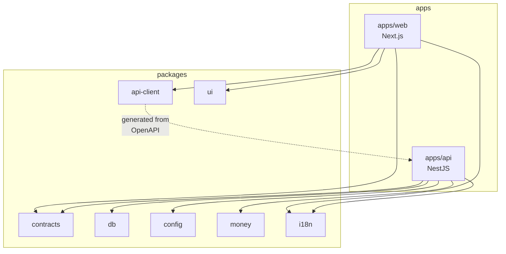
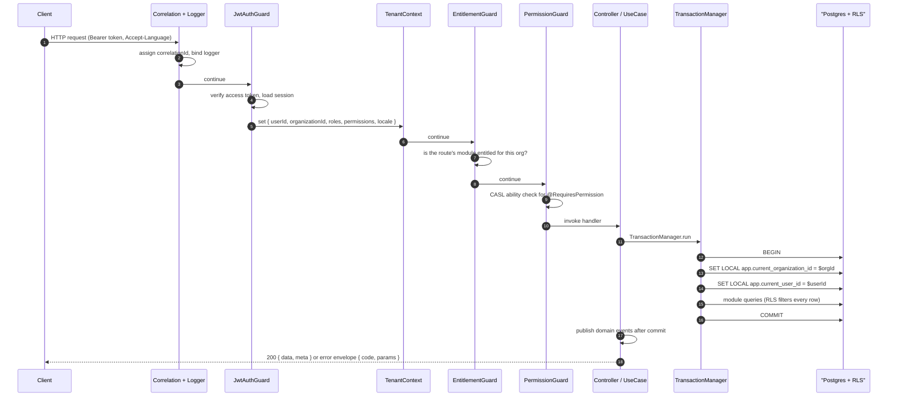
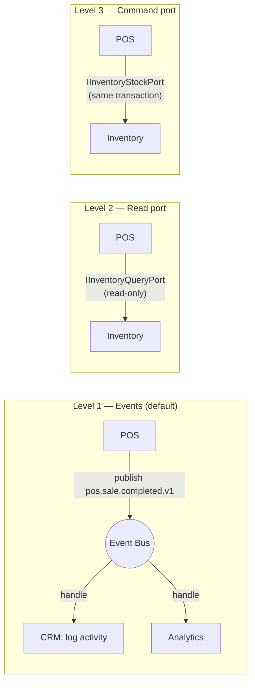
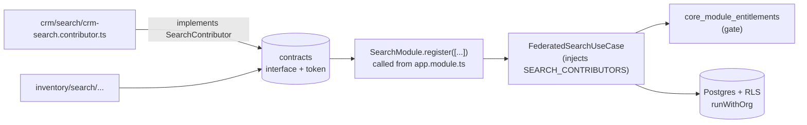
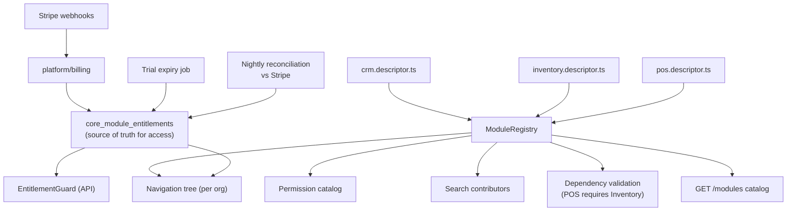

# ModuBiz — Architecture

**Status:** Locked. Version 1.0. Companion documents:
[TECH_STACK.md](./TECH_STACK.md) (what we use) ·
[MODULE_GUIDE.md](./MODULE_GUIDE.md) (how to add a module) ·
[DATA_MODEL.md](./DATA_MODEL.md) (persistence).

---

## 1. Architectural principles

1. **Modular monolith.** One deployable API. Boundaries are enforced by tooling,
   not by goodwill.
2. **Modules own their data.** A module reads and writes only its own tables.
   Never another module's.
3. **Depend inward.** `modules/*` → `platform/*` → `core/*`. Never the reverse.
   `core/` knows nothing about any business module.
4. **No module knows another module exists** — except through a declared
   contract (event or port) defined in `@modubiz/contracts`.
5. **Tenancy is infrastructure.** No feature code passes `organizationId` by
   hand into queries; the database enforces isolation.
6. **Contract-first integration.** Event payloads and port interfaces are
   versioned types in a shared package, not ad-hoc objects.
7. **Every boundary validates.** HTTP input, event payloads, environment
   variables, and external API responses are all parsed with Zod.
8. **Extractable by construction.** Any module could be lifted into its own
   service by replacing its transport adapters only.

---

## 2. Repository layout

```
modubiz/
├── apps/
│   ├── api/                      # NestJS 11 — the modular monolith
│   └── web/                      # Next.js 15 App Router
├── packages/
│   ├── contracts/                # SHARED CONTRACTS ONLY: event payloads, port interfaces,
│   │                             # enums, Zod schemas, permission keys, module keys
│   ├── api-client/               # generated typed REST client (do not hand-edit)
│   ├── db/                       # Drizzle schema barrel, migration runner, RLS helpers, seeds
│   ├── config/                   # Zod-validated env + runtime config (only place touching process.env)
│   ├── money/                    # Money value object, currency registry, rounding, FX conversion
│   ├── i18n/                     # locale catalogs, locale/direction resolution, formatters
│   ├── ui/                       # shadcn/ui component library
│   ├── eslint-config/
│   └── tsconfig/
├── docs/
├── tooling/
│   └── generators/module/        # `pnpm generate:module` templates
├── turbo.json
├── pnpm-workspace.yaml
├── docker-compose.yml
├── AGENTS.md
├── CLAUDE.md
└── README.md
```



> `packages/contracts` must contain **no runtime dependency on Nest, Drizzle, or
> React**. It is pure types plus Zod schemas. This is what keeps it safely
> shareable.

---

## 3. Inside `apps/api`

```
apps/api/src/
├── main.ts
├── app.module.ts                 # composes core + platform + registered modules
│
├── core/                         # SHARED KERNEL. Stable, module-agnostic. Modules may import from here.
│   ├── auth/                     # Passport strategies, token service, session store, password hashing
│   ├── tenancy/                  # TenantContext (AsyncLocalStorage), middleware, RLS session binding
│   ├── authorization/            # CASL ability factory, guards, @RequiresPermission, @RequiresModule
│   ├── entitlements/             # EntitlementService + guard (reads platform state, no Stripe knowledge)
│   ├── database/                 # Drizzle provider, TransactionManager, UnitOfWork, repository base
│   ├── events/                   # EventBus abstraction, publisher, typed listener decorator, outbox
│   ├── jobs/                     # BullMQ queue registration + base processor
│   ├── cache/                    # tenant-namespaced cache service
│   ├── audit/                    # AuditLogger + interceptor
│   ├── notifications/            # notification dispatch ports (in-app + email)
│   ├── storage/                  # R2 presigned upload/download
│   ├── i18n/                     # request locale resolution, template rendering
│   ├── observability/            # logger, tracing, metrics, correlation id
│   └── common/                   # base DTOs, pagination, filtering, error model, interceptors, pipes
│
├── platform/                     # Tenant-facing platform capabilities. May import core/.
│   ├── organizations/
│   ├── users/
│   ├── memberships/
│   ├── invitations/
│   ├── roles/
│   ├── billing/                  # Stripe adapter, webhooks, subscription sync
│   ├── module-registry/          # descriptor collection, enable/disable, trial orchestration
│   ├── audit-log/                # read API over core/audit storage
│   ├── search/                   # federated search aggregator
│   └── fx-rates/                 # daily rate snapshots
│
└── modules/                      # BUSINESS MODULES. Bounded contexts. May import core/ and @modubiz/contracts.
    ├── crm/
    ├── inventory/
    └── pos/
```

### Import legality matrix

| From ↓ / May import → | `core/` | `platform/`                   | another `modules/x` | `modules/x/public` | `@modubiz/contracts` |
| --------------------- | ------- | ----------------------------- | ------------------- | ------------------ | -------------------- |
| `core/`               | ✅      | ❌                            | ❌                  | ❌                 | ✅                   |
| `platform/`           | ✅      | ✅                            | ❌                  | ❌                 | ✅                   |
| `modules/a/`          | ✅      | ❌ (use `core/` abstractions) | ❌                  | ❌                 | ✅                   |
| **composition root**  | ✅      | ✅                            | ❌                  | ✅                 | ✅                   |

**There is no legal path from one module to another's source.** Cross-module
needs are satisfied by events or ports declared in `@modubiz/contracts` — see
§6. This matrix is enforced by an ESLint boundary rule **and** an architecture
test ([TESTING.md §5](./TESTING.md#5-architecture-boundary-tests)).

### The composition root exception

Something must know which modules exist. Exactly **two files** are permitted to
import a module's `public/` barrel, and they constitute the composition root:

```
apps/api/src/app.module.ts                                  # imports the Nest module classes
apps/api/src/platform/module-registry/registered-modules.ts  # imports the module descriptors
```

Everything else — including the rest of `platform/` — reaches modules only
through the registry's runtime data, never through an import. The
`ModuleDescriptor` type and the `defineModule()` helper live in
**`@modubiz/contracts`**, not in `platform/`, precisely so that a module can
declare its descriptor without importing `platform/`.

Adding a module therefore edits two files outside its own folder, both in the
composition root, and zero files in `core/`.

---

## 4. Layering inside a module

Each module is a small hexagonal application.

```
modules/inventory/
├── inventory.module.ts            # Nest module wiring
├── inventory.descriptor.ts        # ModuleDescriptor (see MODULE_GUIDE.md §2)
│
├── api/                           # INBOUND ADAPTER — HTTP only
│   ├── products.controller.ts
│   ├── stock.controller.ts
│   └── dto/                       # request/response schemas (Zod) + OpenAPI decorations
│
├── application/                   # USE CASES — orchestration, transactions, authorization checks
│   ├── create-product.use-case.ts
│   ├── adjust-stock.use-case.ts
│   └── ports/                     # interfaces this module needs from the outside
│
├── domain/                        # PURE DOMAIN — entities, value objects, invariants, domain errors
│   ├── product.entity.ts
│   ├── stock-movement.entity.ts
│   ├── stock-level.vo.ts
│   └── errors.ts
│
├── infrastructure/                # OUTBOUND ADAPTERS
│   ├── repositories/              # Drizzle implementations of domain repository interfaces
│   └── adapters/
│
├── events/
│   ├── published/                 # thin classes wrapping payload types from @modubiz/contracts
│   └── handlers/                  # listeners for OTHER modules' published events
│
├── ports/
│   └── inventory-stock.port.impl.ts   # implements a contract interface for other modules
│
├── db/
│   ├── schema.ts                  # Drizzle tables owned by this module (prefix: inv_)
│   └── migrations/                # module-owned migrations, including RLS policies
│
├── jobs/                          # BullMQ processors owned by this module
├── search/                        # search contributor
├── public/
│   └── index.ts                   # the module's only export surface (usually just the descriptor)
└── __tests__/
    ├── unit/
    ├── integration/
    └── isolation/                 # MANDATORY tenant-isolation tests
```

### Layer rules

| Layer              | May depend on                                                                   | Must never                                                          |
| ------------------ | ------------------------------------------------------------------------------- | ------------------------------------------------------------------- |
| `api/`             | `application/`, `core/common`, contracts                                        | Contain business logic; touch repositories or the database directly |
| `application/`     | `domain/`, port interfaces, `core/` services                                    | Import Drizzle, Nest HTTP types, or Fastify types                   |
| `domain/`          | Nothing but `@modubiz/money`, `@modubiz/contracts` types, and language builtins | Import Nest, Drizzle, HTTP, or any I/O                              |
| `infrastructure/`  | `domain/` interfaces, `core/database`, Drizzle                                  | Be imported by `domain/`                                            |
| `events/handlers/` | `application/` use cases                                                        | Contain business logic inline                                       |

**Rule of thumb:** if you deleted `api/` and `infrastructure/`, the module's
business rules should still compile and be unit-testable.

---

## 5. Request lifecycle



### Non-negotiables in this flow

- **The tenant id is never a function argument in business code.** It lives in
  `TenantContext` (AsyncLocalStorage) and is applied to the database session by
  `TransactionManager`.
- **Every query runs inside a transaction** that has already set
  `app.current_organization_id`. A query outside a tenant-bound transaction
  returns zero rows by design — RLS with a missing session variable denies
  access rather than leaking.
- **Domain events are published after commit**, never inside the transaction, so
  a handler can never observe uncommitted state. Events that must not be lost
  use the transactional outbox in `core/events`.
- **Errors leave the API as codes**, not sentences (see
  [CODING_STANDARDS.md §7](./CODING_STANDARDS.md#7-error-model)).

### System-context routes

A small, explicitly annotated set of routes runs without a tenant: signup,
login, refresh, password reset, Stripe webhooks, health checks, and the module
catalog. They are marked `@PublicRoute()` or `@SystemContext()`, are listed in a
single allowlist file, and adding one requires a security review note in the PR.

---

## 6. Cross-module communication

Three mechanisms, in strict order of preference — plus the federated-search
contribution pattern at the end of the section, where modules contribute results
to a platform aggregator rather than communicating with each other.



### Level 1 — Asynchronous events (use this unless you can't)

- Payload types and event names live in `@modubiz/contracts/events`.
- Names are `<module>.<aggregate>.<pastTenseAction>.v<major>`, e.g.
  `inventory.stock.depleted.v1`.
- Publishers do not know or care who listens. Handlers must be **idempotent**
  and must not throw back into the publisher's request.
- Suitable for: notifications, denormalized read models, analytics, side effects
  that tolerate eventual consistency.

### Level 2 — Read-only query port

For synchronous reads across a boundary (e.g. POS showing live stock on the
product picker):

- The consumer depends on an interface + injection token exported from
  `@modubiz/contracts/ports`.
- The owning module provides the implementation. The consumer **never** imports
  the implementation.
- Both modules declare it: `providesPorts` / `consumesPorts` in their
  descriptors.

### Level 3 — Transactional command port

Only for operations requiring strong consistency within one transaction. The
canonical case: **POS checkout must deduct inventory atomically with the sale.**

- Same rules as Level 2, plus: the port method accepts the ambient transaction,
  and the owning module's implementation must enforce its own invariants (POS
  cannot bypass inventory rules).
- Adding a Level 3 port requires an explicit note in the PR describing why
  eventual consistency is insufficient.

```typescript
// packages/contracts/src/ports/inventory-stock.port.ts
export const INVENTORY_STOCK_PORT = Symbol('INVENTORY_STOCK_PORT');

export interface InventoryStockPort {
  getAvailability(input: {
    productVariantIds: string[];
    warehouseId: string;
  }): Promise<AvailabilitySnapshot[]>;
  reserve(
    input: ReserveStockInput,
    tx: TransactionRef,
  ): Promise<ReservationRef>;
  commitReservation(reservationId: string, tx: TransactionRef): Promise<void>;
  releaseReservation(reservationId: string, tx: TransactionRef): Promise<void>;
}
```

### Federated search — the `register()` pattern

Search is a platform capability that business modules **contribute to**: each
module implements a `SearchContributor`, and `SearchModule` aggregates every
registered contributor's results under `GET /v1/search`. This is not
module-to-module communication (Levels 1–3 above); it is a module-to-platform
contribution, wired exclusively through the composition root.



#### The contract

- `SearchContributor`, `SearchResult`, and the `SEARCH_CONTRIBUTORS` token live
  in `@modubiz/contracts/ports`, so a module implements the interface by
  importing `@modubiz/contracts` alone — never `platform/`.
- A contributor exposes `moduleKey` and `labelKey` (an i18n key, never a display
  string) and implements
  `search(query, organizationId, limit): Promise<SearchResult[]>`. Each result
  carries `title`, an optional `description`, an `href` into the module's own
  frontend routes, and an optional `icon` name.

#### Adding a module's contributor

1. Implement the interface in
   `modules/<key>/search/<key>-search.contributor.ts`. Run queries inside
   `TransactionManager.runWithOrg(organizationId, ...)` so RLS scopes every
   query to the requesting organization — the contributor never filters by
   `organization_id` itself (AGENTS.md hard rule 2).
2. Export the class from the module's `public/index.ts`.
3. Pass it to `SearchModule.register([...])` in `app.module.ts` — the only
   composition-root edit, consistent with §3.

#### Why a dynamic `register()`?

Nest resolves a provider's dependencies only from its own module and the modules
it imports. `FederatedSearchUseCase` lives inside `SearchModule`, so
`SEARCH_CONTRIBUTORS` must also be provided there. Registering the token at
`AppModule` level would make it invisible to the use case and fail at boot with
`UnknownDependenciesException`. `SearchModule.register(...)` is a dynamic module
that places the collection in the right context:

```typescript
static register(contributors: Array<Type<SearchContributor>>): DynamicModule {
  // One named provider per contributor CLASS, so Nest instantiates it with
  // its own DI deps (TransactionManager / DRIZZLE_DB come from the @Global
  // DatabaseModule).
  const contributorProviders = contributors.map((contributor, index) => ({
    provide: `SEARCH_CONTRIBUTOR_${index}`,
    useClass: contributor,
  }));

  return {
    module: SearchModule,
    imports: [ModuleRegistryModule], // entitlement data for the gate below
    controllers: [SearchController],
    providers: [
      FederatedSearchUseCase,
      ...contributorProviders,
      {
        provide: SEARCH_CONTRIBUTORS,
        useFactory: (...instances: SearchContributor[]) => instances,
        inject: contributorProviders.map((provider) => provider.provide),
      },
    ],
  };
}
```

#### Why not `multi: true`?

The repository's Nest build (`@nestjs/core@11.0.3`) **ignores the `multi` flag**
— multi-providers resolve as last-wins bare values. The collection is therefore
assembled explicitly: one named provider per contributor class, aggregated into
`SEARCH_CONTRIBUTORS` by a `useFactory`. Do not "simplify" this back to
`multi: true`; it would silently degrade to a single contributor.

#### Runtime behaviour

- The use case reads `core_module_entitlements` inside a tenant-bound
  transaction and queries only contributors whose module is in an active
  entitlement state (`active`, `trialing`, `past_due`) — search never surfaces
  rows from a disabled module, matching navigation and dashboard widgets.
- Contributors are queried in parallel with `Promise.allSettled`; a failing
  contributor is logged and skipped rather than crashing the request.
- Results are grouped by module and capped per contributor (`limit`, max 20).

### Forbidden

- Importing another module's service, repository, entity, or Drizzle schema.
- Reading or writing another module's tables — including "just a `SELECT`",
  including joins.
- Adding a foreign key that crosses a module boundary (reference by id; validate
  through a port).
- A shared "kitchen-sink" service in `core/` that exists only to let two modules
  talk.

---

## 7. Module registry and entitlements



- Descriptors are collected at boot. Boot **fails** if a module declares a
  dependency that is not registered, or declares a duplicate permission or event
  name.
- `core_module_entitlements` is the runtime authority for access. Stripe is the
  commercial authority; a nightly job reconciles the two and alerts on drift.
- `EntitlementGuard` runs before permission checks: an unentitled module returns
  `403 MODULE_NOT_ENTITLED` regardless of the user's role.
- The frontend renders navigation and routes from `GET /me/navigation`, which is
  derived from entitlements + permissions. **The UI never hardcodes a module
  list.**

---

## 8. Cross-cutting concerns

| Concern         | Where it lives                       | Rule for feature code                                                                                       |
| --------------- | ------------------------------------ | ----------------------------------------------------------------------------------------------------------- |
| Tenancy         | `core/tenancy` + RLS                 | Never pass `organizationId` into a repository method; never build a query that filters it manually          |
| Authorization   | `core/authorization`                 | Declare intent with decorators; do not write `if (user.role === ...)` in services                           |
| Money           | `@modubiz/money`                     | Never do arithmetic on raw numbers; never sum across currencies without explicit conversion                 |
| Locale          | `core/i18n` + `TenantContext.locale` | Never return a user-facing sentence from the API; never format a date/number by hand                        |
| Transactions    | `core/database` `TransactionManager` | One transaction per use case; repositories join the ambient transaction                                     |
| Events          | `core/events`                        | Publish after commit; handlers idempotent                                                                   |
| Audit           | `core/audit`                         | Mutating use cases record an audit entry; do not roll your own logging for this                             |
| Caching         | `core/cache`                         | Keys are always `org:<orgId>:<module>:<...>`; a cache read must be impossible to serve across tenants       |
| Background work | `core/jobs`                          | Job payloads carry `organizationId` explicitly and re-establish tenant context before touching the database |
| Observability   | `core/observability`                 | Use the injected logger; `console.log` is a lint error                                                      |
| Errors          | `core/common/errors`                 | Throw typed domain errors; the global filter maps them to HTTP + error codes                                |

---

## 9. Frontend architecture

```
apps/web/src/
├── app/
│   ├── (auth)/                   # login, signup, invitation acceptance, password reset
│   ├── (marketing)/
│   └── [locale]/(dashboard)/
│       ├── layout.tsx            # shell: nav from GET /me/navigation, org switcher, locale + dir
│       ├── dashboard/
│       ├── settings/             # org, members, roles, billing, modules marketplace
│       └── m/
│           ├── crm/
│           ├── inventory/
│           └── pos/
├── features/                     # mirrors backend modules: components, hooks, forms per feature
│   ├── crm/
│   ├── inventory/
│   └── pos/
├── lib/
│   ├── api/                      # @modubiz/api-client instance, auth interceptor, error mapping
│   ├── auth/                     # session, org switching
│   ├── entitlements/             # useModuleEnabled(), <ModuleGate>
│   └── permissions/              # usePermission(), <Can>
└── messages/                     # re-exported from @modubiz/i18n
```

Frontend rules:

1. **Never call `fetch` directly** to the API. Use the generated client via
   TanStack Query hooks.
2. Every module surface is wrapped in `<ModuleGate module="crm">`; every
   mutating control is wrapped in `<Can permission="crm:contact:update">`.
   Server-side entitlement checks remain authoritative — the gate is UX, not
   security.
3. **No hardcoded user-facing strings.** All copy comes from `next-intl` message
   catalogs. A raw string literal in JSX is a lint error.
4. RTL: use Tailwind logical utilities (`ms-*`, `me-*`, `ps-*`, `pe-*`,
   `start-*`, `end-*`). `ml-*`/`mr-*`/`left-*`/`right-*` are lint errors.
5. Money is rendered only through the shared `<Money>` component /
   `formatMoney()`; never `toFixed(2)`.
6. Feature folders mirror backend modules 1:1, and `features/a` must not import
   from `features/b`.
7. The POS surface is an installable PWA with an offline shell and an IndexedDB
   outbox (see [BUSINESS_RULES.md §7](./BUSINESS_RULES.md#7-pos-rules)).

---

## 10. Path to extraction

A module can become its own service when it needs independent scaling or
isolation. Because of the rules above, the work is bounded:

1. Move `modules/x/` into a new Nest app; it already only depends on `core/` and
   `@modubiz/contracts`.
2. Promote its Level 1 events from in-process EventEmitter2 to a durable broker
   — the `EventBus` abstraction and outbox already exist, so publisher/handler
   code does not change.
3. Replace Level 2/3 port implementations with HTTP or gRPC clients implementing
   the **same contract interface**. Consumers are untouched.
4. Move its `<prefix>_` tables to their own database or schema. Cross-module
   foreign keys do not exist, so nothing breaks.
5. Point the API gateway at the new service for that module's route prefix.

**Every rule in this document exists to keep those five steps true.** Violating
a boundary today converts this list into a rewrite.

**Trigger for reconsideration:** > 2,500 active organizations, or a single
module consuming > 40% of API CPU, or a module requiring a fundamentally
different scaling profile (e.g. Food Delivery real-time fan-out).

---

## 11. Related documents

[PRD.md](./PRD.md) · [TECH_STACK.md](./TECH_STACK.md) ·
[MODULE_GUIDE.md](./MODULE_GUIDE.md) · [DATA_MODEL.md](./DATA_MODEL.md) ·
[BUSINESS_RULES.md](./BUSINESS_RULES.md) ·
[CODING_STANDARDS.md](./CODING_STANDARDS.md) · [TESTING.md](./TESTING.md)
