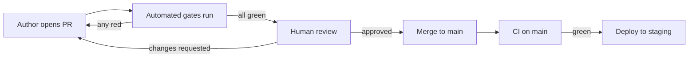

# ModuBiz — Code Quality Assurance Guide

**Status:** Living document. Version 1.0. **Purpose:** Define the processes,
standards, and automated gates that ensure the codebase remains clean,
maintainable, and professional throughout the project lifecycle.

> **Read alongside:** [CODING_STANDARDS.md](./CODING_STANDARDS.md) (the rules) ·
> [TESTING.md](./TESTING.md) (the test strategy) · [PLAN.md](../PLAN.md) (when
> to apply what) This document covers _process and quality management_;
> `CODING_STANDARDS.md` covers _the rules themselves_.

---

## 1. Quality philosophy

ModuBiz is a multi-tenant SaaS platform where the architecture _is_ the product.
A boundary violation or a tenant-isolation bug is not a "code quality issue" —
it is an existential defect. Therefore, code quality here is defined by three
pillars:

| Pillar              | What it means                                                                             | How it is enforced                                                 |
| ------------------- | ----------------------------------------------------------------------------------------- | ------------------------------------------------------------------ |
| **Correctness**     | Business rules are enforced; tenant isolation is airtight; money is exact                 | Automated tests with rule-id traceability; RLS; architecture tests |
| **Maintainability** | Adding the 10th module is as cheap as the 3rd; a new developer can be productive in a day | Layer discipline; module boundaries; clear naming; documentation   |
| **Readability**     | Code reads like prose; the "what" is obvious, the "why" is documented                     | Small files/functions; no clever tricks; comments explain why      |

**The quality bar:** a PR is mergeable only when all automated gates are green
_and_ a human reviewer confirms the change is clean, tested, and documented.
Automation is necessary but not sufficient.

---

## 2. Definition of clean code (for this project)

Clean code in ModuBiz is code that:

1. **Obeys the ten hard rules** in
   [AGENTS.md §1](../AGENTS.md#1-the-ten-hard-rules) — no exceptions, no "just
   this once".
2. **Respects the layer responsibilities** in
   [AGENTS.md §4](../AGENTS.md#4-layer-responsibilities-memorize) — domain has
   no I/O; controllers have no business logic; use cases own transactions.
3. **Never crosses a module boundary** except through events or declared ports
   ([ARCHITECTURE.md §6](./ARCHITECTURE.md#6-cross-module-communication)).
4. **Tests the rule it enforces** — every business rule has a test with the rule
   id in its name
   ([BUSINESS_RULES.md §12](./BUSINESS_RULES.md#12-rule-to-test-traceability)).
5. **Is small and focused** — files ≤ 300 lines, functions ≤ 50 lines,
   cyclomatic complexity ≤ 10
   ([CODING_STANDARDS.md §3](./CODING_STANDARDS.md#3-file-and-function-size)).
6. **Names things clearly** — no `data`, `info`, `helper`, `utils`, `temp`,
   `obj` ([CODING_STANDARDS.md §2](./CODING_STANDARDS.md#2-naming)).
7. **Handles errors explicitly** — typed `AppError` subclasses, never bare
   `Error`, never `catch {}`
   ([CODING_STANDARDS.md §7](./CODING_STANDARDS.md#7-error-model)).
8. **Is observable** — structured logging with correlation id + org id; no
   `console.log`
   ([CODING_STANDARDS.md §8](./CODING_STANDARDS.md#8-logging-and-observability)).
9. **Is internationalized** — no hardcoded user-facing strings; logical CSS only
   ([CODING_STANDARDS.md §10](./CODING_STANDARDS.md#10-frontend-specifics)).
10. **Is documented where it matters** — TSDoc on public services/use cases;
    rule-id comments in domain code; no commented-out code; no `TODO` without an
    issue reference.

---

## 3. Code review process

### 3.1 PR lifecycle

### 3.2 PR requirements

Every PR must include:

1. **What** — a description of the change in plain language.
2. **Why** — the business or technical motivation.
3. **How it was verified** — which tests were run, which manual checks were
   performed.
4. **Rule ids affected** — if the change touches a business rule, link the rule
   ids from [BUSINESS_RULES.md](./BUSINESS_RULES.md).
5. **Rollback plan** — for migrations, document the rollback procedure.
6. **Module DoD checklist** — for new modules, the full
   [MODULE_GUIDE.md §5](./MODULE_GUIDE.md#5-definition-of-done-checklist)
   checklist.

### 3.3 Reviewer checklist

A reviewer verifies, in order of priority:

#### Critical (block merge)

- [ ] No cross-module imports (architecture test + visual check)
- [ ] No manual `organizationId` filtering; RLS is the defence
- [ ] No floating-point money; `Money` used everywhere
- [ ] No hardcoded user-facing strings; i18n keys used
- [ ] No directional CSS (`ml-*`, `text-left`, etc.)
- [ ] No business logic in controllers
- [ ] No framework imports in `domain/`
- [ ] No `process.env` outside `packages/config`
- [ ] No `console.log`; injected logger used
- [ ] No `catch {}` or bare `Error` throws
- [ ] Mutating operations write audit entries
- [ ] Events published after commit, not inside the transaction

#### Quality (block merge if severe)

- [ ] File ≤ 300 lines; function ≤ 50 lines; complexity ≤ 10
- [ ] Naming follows [CODING_STANDARDS.md §2](./CODING_STANDARDS.md#2-naming)
- [ ] One logical change per PR (no mixed refactor + feature)
- [ ] Tests cover new/changed domain invariants with rule ids
- [ ] Integration tests cover new use cases against real Postgres
- [ ] Tenant-isolation test present for new module/tenant table
- [ ] Error codes are stable, documented, and mapped in i18n catalogs
- [ ] Loading, empty, and error states present for new data views
- [ ] `<ModuleGate>` and `<Can>` used on frontend surfaces

#### Documentation (block merge if missing)

- [ ] Affected docs updated in the same PR
- [ ] TSDoc on new public services/use cases
- [ ] Rule-id comments in domain code where a rule is enforced
- [ ] No `TODO` without an issue reference
- [ ] No commented-out code

### 3.4 Review etiquette

- **Review the code, not the author.** Use "this function does X, which causes
  Y" not "you did X wrong".
- **Ask questions before making accusations.** "Why is this a manual filter
  instead of RLS?" opens a discussion; "this violates rule #2" closes it.
- **Approve with comments.** "Approved with nits" means merge after fixing minor
  issues; "Changes requested" means do not merge.
- **Respond to review feedback.** Every comment must be addressed — fixed,
  discussed, or explicitly declined with a reason.
- **Small PRs review faster.** A 50-line PR gets reviewed in minutes; a 500-line
  PR sits for days.

---

## 4. Quality gates

### 4.1 Pre-commit (local, fast)

Runs via Husky + lint-staged on staged files only:

| Gate                | Tool                              | Time |
| ------------------- | --------------------------------- | ---- |
| Format check        | Prettier                          | < 2s |
| Lint (staged files) | ESLint flat config                | < 5s |
| Commit message      | commitlint (Conventional Commits) | < 1s |

### 4.2 CI (on every PR and push to `main`)

Per [TESTING.md §8](./TESTING.md#8-ci-pipeline-and-merge-gates):

| Gate                    | Tool                                | Blocking               | Time budget    |
| ----------------------- | ----------------------------------- | ---------------------- | -------------- |
| Install                 | pnpm `--frozen-lockfile`            | yes                    | < 1 min        |
| Lint + Format           | ESLint + Prettier                   | yes                    | < 2 min        |
| Typecheck               | `tsc --noEmit` (workspace)          | yes                    | < 2 min        |
| Architecture + schema   | dependency-cruiser + custom scripts | yes                    | < 1 min        |
| Unit tests              | Vitest                              | yes                    | < 2 min        |
| Integration + isolation | Vitest + Testcontainers (sharded)   | yes                    | < 8 min        |
| Build                   | API Docker + Next.js                | yes                    | < 5 min        |
| E2E smoke               | Playwright (critical journeys)      | yes (PR); full nightly | < 5 min (PR)   |
| Security scan           | gitleaks + `pnpm audit`             | yes (critical blocks)  | < 2 min        |
| Coverage gates          | Vitest thresholds + ratchet         | yes                    | included above |
| OpenAPI drift           | generate + `git diff --exit-code`   | yes                    | < 1 min        |
| i18n completeness       | custom script                       | yes                    | < 1 min        |
| Business-rule coverage  | rule-id scan in test names          | yes (critical rules)   | < 1 min        |

### 4.3 Pre-merge (human)

- At least one approving review.
- No unresolved review comments.
- All CI gates green.
- Module DoD checklist complete (for new modules).
- Migration rollback plan documented.

### 4.4 Post-merge (on `main`)

- Full E2E suite (nightly).
- Performance suite — k6 nightly (regression > 20% opens an issue).
- Entitlement reconciliation job (nightly).
- Backup verification (nightly; monthly restore drill).

---

## 5. Code smell catalog

These are the smells most likely to appear in this codebase, given its
architecture. Each has a clear fix.

| Smell                                     | Why it's bad                                            | Fix                                                   |
| ----------------------------------------- | ------------------------------------------------------- | ----------------------------------------------------- |
| **Cross-module import**                   | Destroys the boundary and the extraction path           | Replace with an event or a declared port              |
| **Manual `organizationId` filter**        | Signals RLS was bypassed; a bug waiting to happen       | Remove the filter; rely on `TransactionManager` + RLS |
| **Business logic in a controller**        | Untestable, bypassed by jobs and event handlers         | Move to a use case                                    |
| **`float`/`number` for money**            | Silent financial corruption                             | Use `@modubiz/money`                                  |
| **Hardcoded string in JSX**               | Blocks all non-English markets                          | Use `next-intl` message key                           |
| **Directional CSS (`ml-4`, `text-left`)** | Breaks RTL                                              | Use logical utilities (`ms-4`, `text-start`)          |
| **`if (user.role === 'ADMIN')`**          | Bypasses the authorization system                       | Use `@RequiresPermission` / CASL                      |
| **`throw new Error('...')`**              | No stable code; client can't render a localized message | Throw a typed `AppError` subclass                     |
| **`console.log`**                         | No correlation id, no org id, not redacted              | Use the injected Pino logger                          |
| **`catch {}`**                            | Swallows errors silently                                | Handle, wrap with context, or rethrow                 |
| **`process.env.X` outside config**        | Bypasses validation; untestable                         | Use the typed `ConfigService`                         |
| **God use case** (5+ dependencies)        | Doing too much; hard to test                            | Split into smaller use cases                          |
| **God file** (> 300 lines)                | Too many responsibilities                               | Split by responsibility                               |
| **Deep nesting** (> 3 levels)             | Hard to read; hard to test                              | Early returns and guard clauses                       |
| **N+1 query**                             | Performance killer at scale                             | Batch related reads in the repository                 |
| **Event published inside transaction**    | Handler can observe uncommitted state                   | Publish after commit (or use outbox)                  |
| **`TODO` without issue**                  | Undiscoverable debt                                     | Add an issue reference: `// TODO(#412): …`            |
| **Commented-out code**                    | Dead weight; git remembers                              | Delete it                                             |
| **Barrel re-export chain**                | Unclear what's exported; circular import risk           | Only `public/index.ts` and package roots are barrels  |
| **`as unknown as T`**                     | Unsafe cast; bypasses the type system                   | Zod parse and narrow                                  |
| **FK across module prefixes**             | Couples schemas permanently                             | Store id; validate through a port                     |

---

## 6. Technical debt management

### 6.1 What is debt?

Debt is any deviation from the standards in this document,
[CODING_STANDARDS.md](./CODING_STANDARDS.md), or
[ARCHITECTURE.md](./ARCHITECTURE.md) that is intentionally shipped with a plan
to fix it later.

**Not debt:** a deliberate, documented design decision that differs from a
standard (e.g., an ADR-approved exception). That's an _architecture decision_,
not debt.

### 6.2 Debt rules

1. **Every debt item has an issue.** A `TODO(#412)` without an issue is not debt
   — it's litter.
2. **Debt is tracked.** A `tech-debt` label on GitHub issues; a quarterly review
   prioritizes items.
3. **Debt has a cost.** The issue describes the impact (maintenance cost,
   performance, risk) and the fix estimate.
4. **Debt is bounded.** No PR may introduce debt in a _critical_ area (tenancy,
   money, auth, RLS) — those are always done right.
5. **Debt is paid down.** A debt budget of ~15% of each sprint is allocated to
   paying down the highest-priority items.

### 6.3 Debt triage

| Priority          | Criteria                                                       | Action                        |
| ----------------- | -------------------------------------------------------------- | ----------------------------- |
| **P0 — Critical** | Affects tenancy, money, auth, or a critical business rule      | Fix immediately; do not ship  |
| **P1 — High**     | Affects maintainability or performance; will block future work | Fix within the current sprint |
| **P2 — Medium**   | Minor deviation; no immediate impact                           | Schedule within the quarter   |
| **P3 — Low**      | Cosmetic; nice-to-have                                         | Track; fix when touched       |

### 6.4 Refactoring triggers

Refactor when:

- A file exceeds 300 lines or a function exceeds 50 lines.
- A use case has more than 5 dependencies.
- Adding a feature requires understanding more than 2 unrelated modules.
- A test is hard to write because the unit under test has too many
  collaborators.
- The same logic appears in 3+ places (extract a shared abstraction in `core/`
  or `@modubiz/contracts`).
- A module boundary is "almost" violated (e.g., a near-cross-module import) —
  redesign before it becomes a real violation.

**Refactoring rule:** a PR that refactors must not also add a feature. Split
them. (See
[CODING_STANDARDS.md §13](./CODING_STANDARDS.md#13-git-and-pull-requests).)

---

## 7. Quality metrics

### 7.1 What we measure

| Metric                                        | Target                                    | Source                     | Cadence |
| --------------------------------------------- | ----------------------------------------- | -------------------------- | ------- |
| Test coverage — `domain/`                     | ≥ 95% line / 90% branch                   | Vitest                     | Per PR  |
| Test coverage — `application/`                | ≥ 90% line / 85% branch                   | Vitest                     | Per PR  |
| Test coverage — `core/`                       | ≥ 90% line / 85% branch                   | Vitest                     | Per PR  |
| Test coverage — `packages/money`, `contracts` | ≥ 95% line / 90% branch                   | Vitest                     | Per PR  |
| Test coverage — overall                       | ≥ 80% line / 75% branch                   | Vitest                     | Per PR  |
| Coverage ratchet                              | No decrease vs main                       | Vitest                     | Per PR  |
| Business-rule coverage                        | Every critical rule id in a test name     | Custom script              | Per PR  |
| Architecture violations                       | 0                                         | dependency-cruiser + tests | Per PR  |
| RLS coverage                                  | 100% of tenant tables have policy + FORCE | Custom script              | Per PR  |
| i18n completeness                             | 100% keys in all locales                  | Custom script              | Per PR  |
| OpenAPI drift                                 | 0                                         | generate + `git diff`      | Per PR  |
| Lint errors                                   | 0                                         | ESLint                     | Per PR  |
| Type errors                                   | 0                                         | `tsc --noEmit`             | Per PR  |
| Critical dependency advisories                | 0                                         | `pnpm audit`               | Per PR  |
| Secrets in source                             | 0                                         | gitleaks                   | Per PR  |
| p95 API latency                               | < 300 ms                                  | k6                         | Nightly |
| p99 API latency                               | < 800 ms                                  | k6                         | Nightly |
| POS checkout p95                              | < 250 ms                                  | k6                         | Nightly |
| Flaky tests                                   | 0 (quarantined + fixed within 1 week)     | CI                         | Daily   |
| PR size (median)                              | < 200 lines changed                       | GitHub                     | Weekly  |
| PR review time (median)                       | < 24 hours                                | GitHub                     | Weekly  |

### 7.2 What we do not measure

- **Lines of code** — a productivity metric that incentivizes the wrong
  behaviour.
- **Commit count** — same.
- **Individual developer metrics** — quality is a team outcome; individual
  metrics create perverse incentives.
- **100% coverage as a goal** — coverage is a floor; a test that asserts nothing
  is worse than no test.

### 7.3 Dashboards

- **CI dashboard** — pass rate, duration per stage, flaky test count.
- **Coverage dashboard** — per-package coverage trend over time.
- **Quality dashboard** — open debt items by priority, debt age, debt burn-down.
- **Performance dashboard** — p95/p99 latency trend, regression alerts.

---

## 8. Security quality

Security is a subset of quality with a higher bar: a security defect can
compromise all tenants.

### 8.1 Security checklist (per PR touching auth, tenancy, or external calls)

- [ ] No `organizationId` from client input (derived from session)
- [ ] No database access outside `TransactionManager.run()`
- [ ] No `BYPASSRLS`; app connects as non-owner
- [ ] No SQL string concatenation (Drizzle builder or `sql` templates)
- [ ] No secrets in source, tests, fixtures, logs, or error messages
- [ ] All authorization decisions server-side (client gating is UX only)
- [ ] File uploads: presigned, content-type + size validated, org-namespaced
      keys
- [ ] Webhooks: signature verified before parsing body
- [ ] Rate limits on auth, invitation, export, sync endpoints
- [ ] CORS: explicit allowlist; cookies `httpOnly`, `secure`, `sameSite=lax`
- [ ] User-supplied HTML sanitized; `dangerouslySetInnerHTML` has a review note
- [ ] Dependencies scanned; critical advisory blocks merge

### 8.2 Security review (for high-risk changes)

Changes to the following require an explicit security review note in the PR:

- Authentication or session management
- RLS policies or database roles
- Billing or Stripe integration
- Money arithmetic or FX conversion
- Any `@PublicRoute()` or `@SystemContext()` route
- Any new external API integration

---

## 9. Performance quality

### 9.1 Performance checklist (per PR touching a hot path)

- [ ] `organization_id` is the first column in composite indexes
- [ ] List endpoints are paginated (cursor-based by default)
- [ ] No unbounded `SELECT *`
- [ ] No N+1 (batch related reads; integration tests may assert query counts)
- [ ] No full ledger scan on the request path (use projections/materialized
      views)
- [ ] Soft-deleted rows excluded by default
- [ ] One transaction per use case; no transaction open across external HTTP
- [ ] `SELECT ... FOR UPDATE` or atomic `UPDATE ... RETURNING` for increments
- [ ] Cache keys namespaced `org:<orgId>:...`

### 9.2 Performance budget

| Path                              | Budget   | Enforcement        |
| --------------------------------- | -------- | ------------------ |
| Tenant-scoped list endpoint (p95) | < 300 ms | k6 nightly         |
| Tenant-scoped list endpoint (p99) | < 800 ms | k6 nightly         |
| POS add-to-cart (local)           | < 150 ms | E2E + offline test |
| POS checkout (server-side p95)    | < 250 ms | k6 nightly         |
| Unit test suite                   | < 2 min  | CI                 |
| Integration test suite            | < 8 min  | CI                 |
| PR E2E smoke                      | < 5 min  | CI                 |

---

## 10. Documentation quality

### 10.1 Documentation is code

Documentation drift is a defect
([CODING_STANDARDS.md §12](./CODING_STANDARDS.md#12-comments-and-documentation)).
A change that alters behaviour, rules, or structure must update the owning
document in the same PR.

### 10.2 What to document

| Artifact                  | Where                                                                             | When                                          |
| ------------------------- | --------------------------------------------------------------------------------- | --------------------------------------------- |
| Business rule             | [BUSINESS_RULES.md](./BUSINESS_RULES.md)                                          | When a rule is added or changed               |
| Architecture decision     | ADR in `docs/adr/`                                                                | When a non-obvious decision is made           |
| API contract              | OpenAPI (generated)                                                               | When a route is added or changed              |
| Module                    | [README.md](../README.md) module table + [MODULE_GUIDE.md](./MODULE_GUIDE.md) DoD | When a module is added                        |
| Public service / use case | TSDoc                                                                             | When the code is written                      |
| Non-obvious domain logic  | Comment with rule id                                                              | When the code is written                      |
| Migration                 | Rollback plan in PR                                                               | When the migration is written                 |
| Operational runbook       | `docs/runbooks/`                                                                  | When a new operational scenario is identified |

### 10.3 Documentation review

A reviewer checks:

- [ ] Affected docs updated in the same PR
- [ ] TSDoc present on new public APIs
- [ ] Rule-id comments present where a rule is enforced
- [ ] No stale comments (comments that describe code that no longer exists)
- [ ] Examples in docs are correct and would work if copy-pasted

---

## 11. Branch protection and merge rules

### 11.1 `main` branch

- No direct pushes; all changes via PR.
- No force-push.
- Requires: 1 approving review + all CI gates green.
- Linear history (squash or rebase merge; no merge commits).

### 11.2 Branch naming

Per [CODING_STANDARDS.md §13](./CODING_STANDARDS.md#13-git-and-pull-requests):

- `feat/<module>-<short-description>`
- `fix/<module>-<short-description>`
- `chore/<description>`

### 11.3 Release branches

- `release/v1.0` — cut from `main` at the v1.0 tag.
- Bug fixes on `release/v1.0` are cherry-picked to `main`.
- No new features on release branches.

---

## 12. Onboarding quality

A new developer should be productive within one day. This is a quality metric
for the documentation and tooling.

### 12.1 Onboarding path

1. Read [AGENTS.md](../AGENTS.md) (hard rules).
2. Read [PLAN.md](../PLAN.md) (what we're building and in what order).
3. Read [ARCHITECTURE.md](./ARCHITECTURE.md) (where code goes).
4. `pnpm install && pnpm docker:up && pnpm db:migrate && pnpm dev`.
5. Pick a small issue from the current phase in [PLAN.md](../PLAN.md).
6. Open a PR following the review process in §3 above.

### 12.2 Onboarding checklist

- [ ] Can run the project locally in < 30 minutes
- [ ] Can run the full test suite
- [ ] Understands the ten hard rules
- [ ] Knows where code goes (layer responsibilities)
- [ ] Knows how to add a module (MODULE_GUIDE.md)
- [ ] Knows how to run the quality gates locally

---

## 13. Quality improvement process

### 13.1 Retrospectives

- Bi-weekly team retrospective.
- Quality is a standing agenda item: what broke, what was hard, what smell is
  appearing.
- Action items become issues with owners and due dates.

### 13.2 Quarterly quality review

- Review the debt backlog; reprioritize.
- Review the metrics dashboard; identify trends.
- Review the code smell catalog; add new smells observed.
- Review the test pyramid; rebalance if needed.
- Update this document if the process has changed.

### 13.3 Continuous improvement

- If a rule is violated repeatedly, automate its enforcement (add a lint rule,
  an architecture test, or a CI gate).
- If a rule is never violated, consider whether it's still necessary.
- If a standard is unclear, clarify it in
  [CODING_STANDARDS.md](./CODING_STANDARDS.md) — not in a chat message.

---

## 14. Related documents

[AGENTS.md](../AGENTS.md) · [PLAN.md](../PLAN.md) · [PRD.md](./PRD.md) ·
[TECH_STACK.md](./TECH_STACK.md) · [ARCHITECTURE.md](./ARCHITECTURE.md) ·
[MODULE_GUIDE.md](./MODULE_GUIDE.md) · [DATA_MODEL.md](./DATA_MODEL.md) ·
[BUSINESS_RULES.md](./BUSINESS_RULES.md) ·
[CODING_STANDARDS.md](./CODING_STANDARDS.md) · [TESTING.md](./TESTING.md) ·
[UI_UX_GUIDELINES.md](./UI_UX_GUIDELINES.md)
