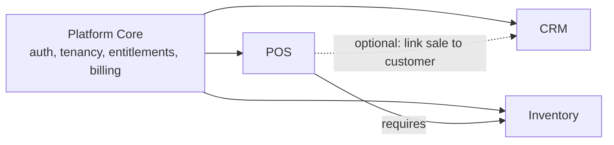
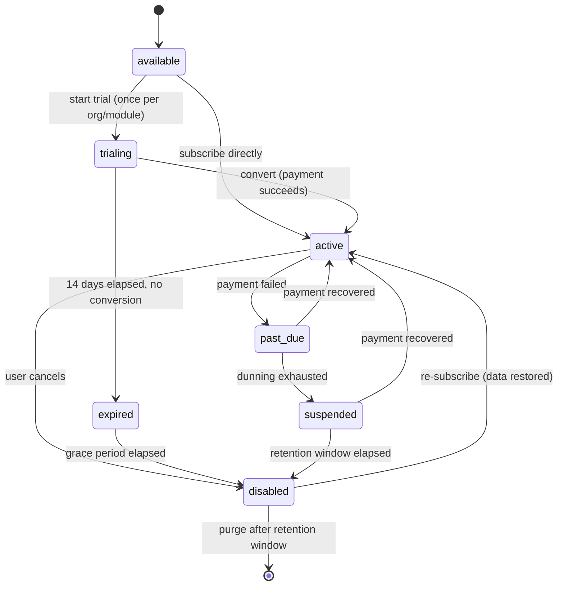

# ModuBiz — Product Requirements Document

|                      |                                                                                            |
| -------------------- | ------------------------------------------------------------------------------------------ |
| **Product**          | ModuBiz                                                                                    |
| **Document version** | 3.0                                                                                        |
| **Status**           | Approved for development                                                                   |
| **Architecture**     | Modular monolith (NestJS 11)                                                               |
| **Supersedes**       | PRD v2.0 (all "either/or" stack items now resolved — see [TECH_STACK.md](./TECH_STACK.md)) |

> This document defines **what** ModuBiz is and **which rules the product must
> obey**. For **how** to build it, see [ARCHITECTURE.md](./ARCHITECTURE.md),
> [MODULE_GUIDE.md](./MODULE_GUIDE.md) and
> [CODING_STANDARDS.md](./CODING_STANDARDS.md). Machine-enforceable domain
> invariants live in [BUSINESS_RULES.md](./BUSINESS_RULES.md) — this PRD states
> intent, that document states law.

---

## 1. Vision

ModuBiz is a multi-tenant SaaS platform where a small or medium business
subscribes to a lightweight core and then **switches on only the business
applications it actually needs** — CRM, Inventory, Point of Sale, and more over
time.

It is positioned as a modern, opinionated alternative to Odoo: dramatically
simpler, faster, genuinely multi-language and multi-currency from day one, and
built so that a new business module can be added by a single competent developer
without touching the core.

**The product bet:** modularity is not a marketing feature, it is the
architecture. If adding the 10th module is as cheap as adding the 3rd, the
product wins.

---

## 2. Product goals

| #   | Goal                                           | How we know we hit it                                                                                 |
| --- | ---------------------------------------------- | ----------------------------------------------------------------------------------------------------- |
| G1  | New modules can be added safely and repeatedly | Adding a module requires **zero** changes to `core/`; ≤ 2 files touched in `platform/module-registry` |
| G2  | Airtight tenant isolation                      | Cross-tenant data access is impossible at the database level, proven by automated tests per module    |
| G3  | Customers pay only for what they use           | Per-module subscription + independent 14-day trial per module                                         |
| G4  | Truly international from day one               | Multi-language (incl. RTL) and multi-currency are platform primitives, not module features            |
| G5  | Scale on a monolith before splitting           | 10,000 active organizations served without extracting a microservice                                  |
| G6  | Production-grade from commit #1                | Observability, RLS, audit log, CI gates present before the first business module ships                |

---

## 3. Target users

### Primary segment

SMBs with **5–50 employees** in retail, restaurants/food service, e-commerce,
and professional services — businesses that have outgrown spreadsheets but for
whom a full ERP is too expensive, too slow, and too complex.

### Personas

| Persona                       | Role                         | Needs                                                                                     | Primary modules  |
| ----------------------------- | ---------------------------- | ----------------------------------------------------------------------------------------- | ---------------- |
| **Layla — Owner/Operator**    | Signs up, pays, owns the org | Fast setup, clear pricing, one login for everything, reports in her currency and language | All (read-heavy) |
| **Karim — Store Manager**     | Runs a physical location     | Fast POS, accurate stock, shift accountability, works when the internet drops             | POS, Inventory   |
| **Nour — Sales Rep**          | Owns the pipeline            | Contacts, deals, follow-up activities, no data entry friction                             | CRM              |
| **Sami — Warehouse Staff**    | Moves stock                  | Receive, transfer, adjust, count; low-stock visibility                                    | Inventory        |
| **Platform Admin (internal)** | ModuBiz staff                | Tenant support, entitlement overrides, incident response                                  | Back-office      |

### Secondary segment

Growing companies (50–200 employees) that want to compose modular software
instead of committing to a monolithic ERP.

---

## 4. Core product requirements

These are **non-negotiable** product-level constraints. They are architectural
requirements expressed as product requirements because violating them destroys
the product thesis.

| ID  | Requirement                                                                                                                                                                                                                                 |
| --- | ------------------------------------------------------------------------------------------------------------------------------------------------------------------------------------------------------------------------------------------- |
| CR1 | Every business capability is an independently enableable **module** with its own data, permissions, navigation, and price.                                                                                                                  |
| CR2 | Modules are **loosely coupled**. Default integration mechanism is asynchronous events. Synchronous coupling is allowed only through an explicitly declared port (see [ARCHITECTURE.md §6](./ARCHITECTURE.md#6-cross-module-communication)). |
| CR3 | Every tenant-owned row carries `organization_id` and is protected by PostgreSQL **Row-Level Security**. Application code is never the only line of defence.                                                                                 |
| CR4 | An **entitlement engine** decides at runtime which modules a tenant may use. Disabling a module removes access without destroying data.                                                                                                     |
| CR5 | All user-facing text is **translatable**; the backend never returns prose intended for end users, only stable error codes and structured data.                                                                                              |
| CR6 | All monetary values are stored as **integer minor units + ISO 4217 currency code**. Floating-point money is a defect.                                                                                                                       |
| CR7 | Any module must be extractable into a standalone service later without rewriting its domain logic.                                                                                                                                          |
| CR8 | Every privileged or data-changing action is written to an immutable **audit log**.                                                                                                                                                          |

---

## 5. Functional scope

### 5.1 Platform core (shared kernel) — required for MVP

| Capability               | Requirements                                                                                                                                                                        |
| ------------------------ | ----------------------------------------------------------------------------------------------------------------------------------------------------------------------------------- |
| **Organizations**        | Create org on signup; org profile (legal name, country, timezone, base currency, default locale); slug; soft delete with retention window                                           |
| **Users & auth**         | Email + password signup, email verification, login, logout, password reset, JWT access token + rotating refresh token, session listing and revocation, optional TOTP 2FA (post-MVP) |
| **Multi-org membership** | One user account may belong to many organizations; active organization is chosen per session; switching orgs re-issues scoped tokens                                                |
| **Invitations**          | Invite by email with role, expiring token, accept/decline, resend, revoke                                                                                                           |
| **RBAC**                 | System roles (`OWNER`, `ADMIN`, `MANAGER`, `MEMBER`, `VIEWER`) plus custom org roles composed of granular permissions contributed by modules                                        |
| **Module registry**      | Catalog of all modules, their metadata, dependencies, permissions, and price references                                                                                             |
| **Entitlements**         | Per-org, per-module state machine; runtime guard on every module endpoint and UI route                                                                                              |
| **Trials**               | Independent 14-day trial per module, once per organization per module, no card required to start                                                                                    |
| **Billing**              | Stripe customer per org; base subscription + one subscription item per enabled module; webhook-driven entitlement sync; invoice history; dunning states                             |
| **Audit log**            | Append-only, tenant-scoped, queryable by actor/entity/action/date                                                                                                                   |
| **Notifications**        | In-app notification centre + transactional email; per-user preferences; module-contributed notification types                                                                       |
| **Global search**        | Federated search across enabled modules via a registered search contributor per module                                                                                              |
| **Localization**         | Org default locale + per-user locale override; `Accept-Language` negotiation; RTL layout support; localized number/date/currency formatting                                         |
| **Currency**             | Org base currency; per-transaction currency; stored FX rate snapshot on every converted amount; base-currency reporting                                                             |
| **Data portability**     | Per-org data export (JSON + CSV) and GDPR erasure request workflow                                                                                                                  |

### 5.2 Module framework — required for MVP

The framework itself is a deliverable, not an afterthought.

- A single declarative **module descriptor** per module (key, version,
  dependencies, permissions, navigation, published events, consumed events,
  provided/consumed ports, Stripe price reference, search contributor, seed
  data).
- Automatic wiring on enable: navigation entries, permission catalog, dashboard
  widgets, search participation, background jobs.
- Standardized, module-owned database migrations.
- Standardized event contract publication and consumption.
- A generator/scaffold so a new module starts from the canonical skeleton rather
  than a copy-paste of an existing one.

### 5.3 MVP business modules

MVP ships **three** modules. POS depends on Inventory; CRM is independent.

#### CRM

- Contacts (people) and Companies, with relationships between them
- Configurable pipelines and stages; Deals with value + currency, expected close
  date, win/loss reason
- Activities (call, meeting, task, email log) with due dates and completion
- Notes, tags, file attachments
- Contact/company merge and duplicate detection
- Pipeline board view, list views with saved filters
- Emits: contact created/updated, deal stage changed, deal won, deal lost

#### Inventory

- Products with variants, SKUs, barcodes, categories, units of measure
- Multi-warehouse / multi-location stock
- **Append-only stock movement ledger** — current stock is derived and
  reconcilable, never silently overwritten
- Receipts, transfers, manual adjustments (with reason code), stock counts
- Stock reservations (used by POS and future E-commerce)
- Reorder points and low-stock alerts
- Product cost tracking (moving average) and stock valuation report
- Emits: stock level changed, stock depleted, reorder point reached, product
  created/archived
- Provides port: `InventoryStockPort` (reserve, commit, release, query
  availability)

#### POS

- Register (till) definitions per location, bound to a warehouse
- **Shifts**: open with opening float, close with counted cash, variance report;
  only one open shift per register
- Cart/checkout: product lookup by search or barcode, quantity, line and order
  discounts, tax lines
- Payments: cash (with change due), card (manual/terminal-agnostic in MVP),
  split payments, store credit deferred
- Receipts: sequential, gap-free numbering per register; printable and
  emailable; multi-language receipt output
- Returns and refunds against an original sale, with restock decision per line
- **Offline-first**: sale can be completed without connectivity, queued locally,
  and synced idempotently
- Optional link of a sale to a CRM contact
- Deducts stock through `InventoryStockPort` inside the checkout transaction
- Emits: sale completed, sale refunded, shift opened, shift closed

### 5.4 Next release modules (post-MVP, pre-hardening)

**Accounting & Invoicing** (Phase 7) and **Purchasing & Suppliers** (Phase 8)
are the first modules after MVP — planned explicitly in [PLAN.md](./PLAN.md)
before production hardening.

#### Accounting & Invoicing

- **Double-entry bookkeeping**: balanced journal entries (total debits = total
  credits), a default SME chart of accounts, sequential entry numbering, and an
  append-only general ledger — posted entries are immutable and corrected only
  by reversal entries.
- **Tax & e-invoicing ready**: multi-tax-rate support (VAT, zero-rated, exempt)
  per line item, plus e-invoice metadata fields (UUID, hash, IRN, QR, status)
  ready for ZATCA Phase 2 / Egyptian ETA compliance adapters behind a provider
  port.
- **Accounts receivable**: invoice lifecycle
  `Draft → Issued → Partially Paid → Paid → Overdue → Void`, credit notes,
  payment application with partial allocations, AR aging.
- **Subledger integration**: automatic invoice generation from completed POS
  sales (idempotent), GL posting from inventory movements and — from Phase 8 —
  purchase bills and supplier payments; goods invoices deduct stock through
  Inventory's movement port in the same transaction.
- **Plan-gated features**: `advanced_coa`, `e_invoicing` toggled per
  organization subscription plan, enforced server-side.

#### Purchasing & Suppliers

- **Supplier directory** with payment terms, tax ids, contact details, and a
  current vendor balance derived from an append-only **vendor ledger** (AP).
- **Purchase workflow**:
  `Purchase Requisition (optional) → Purchase Order → Goods Received Note → Purchase Bill → Payment`.
- **Inventory & cost-basis sync**: GRN receiving increases warehouse stock
  atomically through Inventory's movement port; average-cost/FIFO valuation
  updates on bill approval without rewriting history (cost-variance movement).
- **Supplier returns & debit notes**: return damaged items to suppliers,
  reducing both accounts payable and stock in one transaction.
- **Plan-gated feature**: `purchase_approval` (multi-step approval chain),
  enforced server-side.

Both must be addable per [MODULE_GUIDE.md](./MODULE_GUIDE.md) with **no core
changes**.

### 5.5 Planned future modules (later)

E-commerce storefront · Food Ordering & Delivery (real-time) · HR & Payroll-lite
· Project Management.

### 5.6 Platform Admin Console (back-office)

An internal back-office for ModuBiz staff (the **Platform Admin** persona) to
operate the SaaS itself — separate from tenant-facing dashboards and reached at
`/<locale>/admin`:

| Capability            | What it does                                                                                           |
| --------------------- | ------------------------------------------------------------------------------------------------------ |
| **Organizations**     | Directory of every tenant (search, status, member counts, subscription state, enabled modules); detail |
| **Subscription mgmt** | Per-org module enable/trial/disable (entitlement overrides for support), dependency-aware (BILL-8/9)   |
| **Module pricing**    | Monthly/yearly list prices per module + currency, stored in `core_module_pricing` (display/planning)   |
| **SaaS settings**     | Platform-level settings (platform name, support email, default trial days, self-signup flag)           |

Rules that bound it:

- Platform admins are flagged on `core_users.is_platform_admin`, seeded from
  `PLATFORM_ADMIN_EMAILS` at boot. Every `/v1/admin/*` route is guarded by
  `@RequiresPlatformAdmin` (PLT-1/2).
- Admin access is **org-scoped per query**: operations against a tenant's data
  bind that tenant via `runWithOrg` — RLS stays the isolation backstop, and no
  admin endpoint returns an unscoped cross-tenant scan (PLT-3).
- Every admin mutation lands in `core_platform_audit_log` (append-only) — the
  separately audited code path TEN-5 requires (PLT-4).
- Admin subscription changes reuse the billing domain state machine; they never
  bypass BILL-7/8/9 or the `core_module_entitlements` authority (PLT-5).
- Module pricing is display/planning data; the commercial authority stays Stripe
  (BILL-10). Boot-time catalog mirroring never overwrites admin-set pricing
  (PLT-6).
- Out of scope for the MVP console: refunds/payouts, custom report builder,
  white-labelling, and a public developer SDK.

---

## 6. Module lifecycle

The original spec left "disabled module" behaviour undefined. It is now
explicit.

| State       | API access    | UI visibility                                  | Data                                           |
| ----------- | ------------- | ---------------------------------------------- | ---------------------------------------------- |
| `available` | Denied        | Shown in module marketplace only               | None                                           |
| `trialing`  | Full          | Full, with trial banner and days remaining     | Live                                           |
| `active`    | Full          | Full                                           | Live                                           |
| `past_due`  | Full (grace)  | Full, with payment warning banner              | Live                                           |
| `expired`   | **Read-only** | Read-only, with upgrade prompt                 | Live                                           |
| `suspended` | Denied        | Hidden from navigation; export still available | Retained                                       |
| `disabled`  | Denied        | Hidden from navigation; export still available | Retained for the retention window, then purged |

**Rule:** disabling a module never deletes tenant data during the retention
window. Exact durations and transition authority are specified in
[BUSINESS_RULES.md §4](./BUSINESS_RULES.md#4-subscription-trial-and-entitlement-rules).

**Stripe-driven transitions:** `customer.subscription.deleted` maps
`active`/`trialing`/`expired` modules to `disabled` (cancelled) and `past_due`
modules to `suspended`. The reconciliation job (BILL-4) moves a locally-`active`
module that is absent from the Stripe subscription to `disabled`; `suspended`
remains reachable only through the dunning flow (`past_due` → `suspended`).

---

## 7. Internationalization requirements

> **ID convention:** requirement ids in this document are prefixed `REQ-`. The
> enforceable, test-cited invariants derived from them carry their own ids in
> [BUSINESS_RULES.md](./BUSINESS_RULES.md) (`I18N-*`, `CUR-*`, …). Requirements
> state _what the product must offer_; rules state _what the code must
> guarantee_.

| ID         | Requirement                                                                                                                                                                            |
| ---------- | -------------------------------------------------------------------------------------------------------------------------------------------------------------------------------------- |
| REQ-I18N-1 | Launch locales: `en` (default), `ar` (RTL), `fr`, `es`. Adding a locale must not require code changes outside the locale catalogs.                                                     |
| REQ-I18N-2 | Locale resolution order: explicit request override → authenticated user preference → organization default → `Accept-Language` → `en`.                                                  |
| REQ-I18N-3 | The API returns **stable machine error codes** plus structured parameters. Human-readable message rendering is the client's responsibility.                                            |
| REQ-I18N-4 | Tenant-authored content that end customers see (product names/descriptions, receipt footers, email templates) is **translatable per locale**, with fallback to the org default locale. |
| REQ-I18N-5 | The web UI supports both LTR and RTL, driven by the active locale; no hardcoded directional CSS.                                                                                       |
| REQ-I18N-6 | Dates, times, numbers, and currencies are formatted using the active locale and the org timezone — never with hand-rolled formatting.                                                  |
| REQ-I18N-7 | Customer-facing documents (receipts, invoices) render in the **customer's** locale, which may differ from the operator's.                                                              |

Enforceable form:
[BUSINESS_RULES.md §5](./BUSINESS_RULES.md#5-localization-rules).

## 8. Multi-currency requirements

| ID        | Requirement                                                                                                                                                                                              |
| --------- | -------------------------------------------------------------------------------------------------------------------------------------------------------------------------------------------------------- |
| REQ-CUR-1 | Every organization has exactly one **base currency**, set at onboarding and immutable once any monetary transaction exists.                                                                              |
| REQ-CUR-2 | Money is stored as an integer **minor-unit amount** plus an ISO 4217 code. No `float`, no `double`, no unqualified `number` for money.                                                                   |
| REQ-CUR-3 | A transaction may be recorded in any enabled currency. When it differs from the base currency, the FX rate used is **snapshotted onto the record** — later rate changes never mutate historical figures. |
| REQ-CUR-4 | Cross-currency reporting always uses the stored snapshot rates, never live rates.                                                                                                                        |
| REQ-CUR-5 | Rounding follows the currency's exponent (e.g. JPY 0 decimals, USD 2, KWD 3) using half-up at the presentation boundary; internal arithmetic never rounds intermediate results.                          |
| REQ-CUR-6 | Currency conversion is never performed implicitly. Summing amounts of differing currencies without an explicit conversion step is a defect.                                                              |

Enforceable form:
[BUSINESS_RULES.md §6](./BUSINESS_RULES.md#6-currency-and-money-rules).

---

## 9. Non-functional requirements

| Category               | Requirement                                                                                                                                                            | Verification                                  |
| ---------------------- | ---------------------------------------------------------------------------------------------------------------------------------------------------------------------- | --------------------------------------------- |
| **Performance**        | p95 API latency < 300 ms, p99 < 800 ms for tenant-scoped reads at nominal load                                                                                         | Load test in CI nightly; traces in production |
| **POS responsiveness** | Add-to-cart and checkout confirmation < 150 ms locally; fully functional offline                                                                                       | POS e2e + offline test suite                  |
| **Scalability**        | 10,000 active organizations, 50,000 users, 5M stock movements on a single Postgres primary + read replica                                                              | Capacity test with seeded dataset             |
| **Availability**       | 99.5% monthly for the API; degraded-but-usable POS during API outage                                                                                                   | Uptime monitor + error budget                 |
| **Security**           | Tenant isolation enforced by RLS; OWASP Top 10 addressed; secrets never in source; dependency and container scanning in CI                                             | Automated isolation tests + scanners          |
| **Data durability**    | Point-in-time recovery ≥ 7 days; nightly logical backup verified by restore drill                                                                                      | Monthly restore drill                         |
| **Maintainability**    | Adding a module touches no file under `apps/api/src/core/`; enforced by architecture tests                                                                             | CI boundary tests                             |
| **Observability**      | Every request carries a correlation id, org id, and user id through logs, traces, and error reports                                                                    | Trace sampling review                         |
| **Testability**        | Coverage floors per layer as defined in [TESTING.md §2](./TESTING.md#2-coverage-requirements) (domain 95%, application 90%); every module ships tenant-isolation tests | CI coverage gate                              |
| **Accessibility**      | WCAG 2.1 AA for all core flows; keyboard-operable POS                                                                                                                  | Automated axe checks + manual audit           |
| **Compliance**         | GDPR data export and erasure; audit trail retained ≥ 12 months                                                                                                         | Documented workflow + tests                   |

---

## 10. Pricing model

- **Base platform fee** per organization: includes auth, users, RBAC, audit,
  notifications, search, and 3 seats.
- **Per-seat** add-on above the included seats.
- **Per-module** monthly or annual price, independent per module.
- **14-day free trial per module**, once per organization per module, startable
  without a payment method.
- Currency of billing is set per organization at signup (Stripe-supported
  currencies only) and is independent of the org's operational base currency.

Exact amounts are commercial configuration and live in Stripe — **never
hardcoded in the codebase**. Code refers to modules by `stripePriceKey`,
resolved at runtime.

---

## 11. Success metrics

| Metric                                                             | Target                                                | Instrumentation                            |
| ------------------------------------------------------------------ | ----------------------------------------------------- | ------------------------------------------ |
| Time to add a well-scoped module (after the first three)           | ≤ 3 weeks for one developer                           | Engineering tracking                       |
| Core files changed per new module                                  | 0 files in `core/`, ≤ 2 in `platform/module-registry` | CI architecture report                     |
| Trial → paid conversion                                            | ≥ 25% per module                                      | Product analytics funnel                   |
| Average enabled modules per paying org                             | ≥ 2.2                                                 | Entitlement snapshot job                   |
| Monthly revenue churn                                              | < 5%                                                  | Stripe + analytics                         |
| Cross-tenant data incidents                                        | 0                                                     | Security monitoring + isolation test suite |
| p95 API latency                                                    | < 300 ms                                              | APM                                        |
| POS offline sale sync success rate                                 | ≥ 99.9% within 24h of reconnect                       | Sync job metrics                           |
| Time-to-first-value (signup → first meaningful action in a module) | < 10 minutes median                                   | Onboarding funnel                          |

---

## 12. Out of scope for MVP

- Full double-entry accounting and tax filing (planned as Phase 7 — Accounting &
  Invoicing)
- Manufacturing / MRP / bill of materials
- Native mobile applications (the POS is a responsive, installable PWA)
- Third-party module marketplace and external developer SDK
- On-premise or self-hosted distribution
- Custom report builder (fixed reports only in MVP)
- Workflow automation builder
- White-labelling per tenant

---

## 13. Assumptions and risks

| Risk                                            | Impact   | Mitigation                                                                                                                                           |
| ----------------------------------------------- | -------- | ---------------------------------------------------------------------------------------------------------------------------------------------------- |
| POS offline sync conflicts corrupt stock        | High     | Append-only movement ledger + client idempotency keys + explicit conflict resolution rules ([BUSINESS_RULES.md §7](./BUSINESS_RULES.md#7-pos-rules)) |
| Module boundaries erode under delivery pressure | High     | Automated architecture tests fail the build on cross-module internal imports                                                                         |
| RLS misconfiguration leaks data                 | Critical | App connects as a non-owner role with `FORCE ROW LEVEL SECURITY`; per-module isolation tests are mandatory                                           |
| Stripe webhook loss desynchronizes entitlements | Medium   | Idempotent webhook handling + periodic reconciliation job against Stripe as source of truth                                                          |
| Multi-currency added late becomes a rewrite     | High     | Money primitive and FX snapshotting enforced from the first migration                                                                                |
| Monolith becomes a deployment bottleneck        | Medium   | Ports and events keep modules extractable; capacity reviewed at 2,500 orgs                                                                           |

---

## 14. Related documents

| Document                                     | Purpose                                                           |
| -------------------------------------------- | ----------------------------------------------------------------- |
| [TECH_STACK.md](./TECH_STACK.md)             | Locked technology choices and rejected alternatives               |
| [ARCHITECTURE.md](./ARCHITECTURE.md)         | Repository layout, layering, module boundaries, request lifecycle |
| [MODULE_GUIDE.md](./MODULE_GUIDE.md)         | How to add a new module, step by step                             |
| [DATA_MODEL.md](./DATA_MODEL.md)             | Tenancy, RLS, schema conventions, MVP tables                      |
| [BUSINESS_RULES.md](./BUSINESS_RULES.md)     | Enforceable domain invariants                                     |
| [CODING_STANDARDS.md](./CODING_STANDARDS.md) | Code conventions and forbidden patterns                           |
| [TESTING.md](./TESTING.md)                   | Test strategy, required suites, CI gates                          |
| [../AGENTS.md](../AGENTS.md)                 | Hard rules for AI coding agents                                   |
