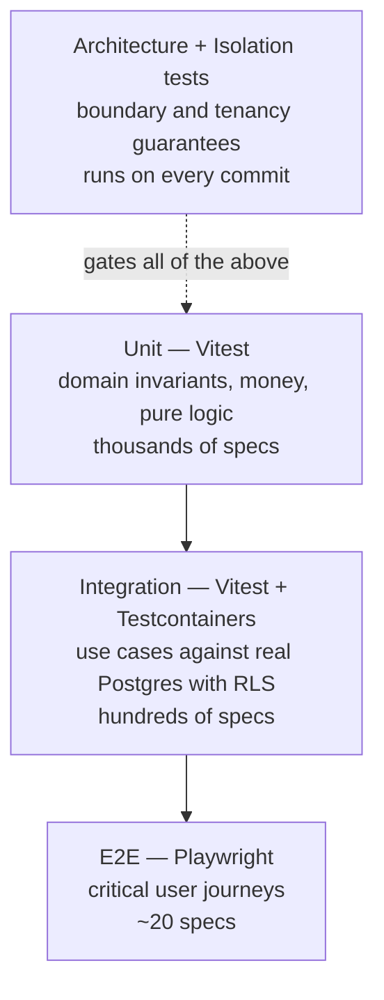
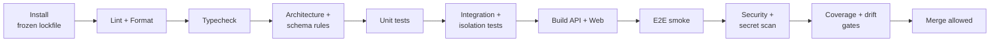

# ModuBiz — Testing Strategy

**Status:** Locked. Version 1.0.

Two categories of test are **mandatory and non-negotiable** for every module,
because they protect the two properties the product cannot survive losing:

1. **Tenant isolation tests** — data must never cross organizations.
2. **Architecture boundary tests** — modules must never couple to each other.

Everything else is standard good practice.

---

## 1. Test pyramid



| Level        | Runner                      | Scope                                             | Database               | Target share |
| ------------ | --------------------------- | ------------------------------------------------- | ---------------------- | ------------ |
| Unit         | Vitest                      | One class/function, no I/O                        | None (all deps faked)  | ~65%         |
| Integration  | Vitest + Testcontainers     | Use case → repository → real Postgres, RLS active | Real                   | ~30%         |
| E2E          | Playwright                  | Browser through the real API                      | Real                   | ~5%          |
| Architecture | Vitest + dependency-cruiser | Static import graph and schema rules              | None                   | always       |
| Isolation    | Vitest + Testcontainers     | Cross-tenant access attempts                      | Real, as `modubiz_app` | always       |

---

## 2. Coverage requirements

| Scope                                                    | Line | Branch | Gate     |
| -------------------------------------------------------- | ---- | ------ | -------- |
| `modules/*/domain/`                                      | 95%  | 90%    | blocking |
| `modules/*/application/`                                 | 90%  | 85%    | blocking |
| `core/` (tenancy, auth, authorization, database, events) | 90%  | 85%    | blocking |
| `packages/money`, `packages/contracts`                   | 95%  | 90%    | blocking |
| `modules/*/api/`                                         | 80%  | —      | blocking |
| Overall workspace                                        | 80%  | 75%    | blocking |
| `apps/web` components                                    | 60%  | —      | warning  |

Rules:

- Coverage is a floor, not a goal. 100% coverage with no assertion of a business
  rule is worthless.
- Coverage must not decrease in a PR (ratchet check).
- Generated code (`@modubiz/api-client`), migrations, and configuration are
  excluded.
- **Every rule id in [BUSINESS_RULES.md](./BUSINESS_RULES.md) must appear in at
  least one test name.** A coverage report of rule ids runs in CI.

---

## 3. Unit tests

Test the domain layer hard: it holds the invariants, and it has no I/O so tests
are instant.

```typescript
describe('StockMovement', () => {
  it('INV-3: rejects a zero quantity movement', () => {
    expect(() => StockMovement.create({ ...valid, quantity: 0 })).toThrow(
      InvalidStockMovementError,
    );
  });

  it('INV-4: rejects an adjustment without a reason code', () => {
    expect(() =>
      StockMovement.create({
        ...valid,
        type: 'ADJUSTMENT',
        reasonCode: undefined,
      }),
    ).toThrowErrorCode('ADJUSTMENT_REQUIRES_REASON');
  });
});

describe('Money', () => {
  it('CUR-4: refuses to add different currencies', () => {
    expect(() =>
      Money.of(100n, 'USD').add(Money.of(100n, 'EUR')),
    ).toThrowErrorCode('CURRENCY_MISMATCH');
  });

  it('CUR-8: allocates a discount without creating or losing minor units', () => {
    const parts = Money.of(1000n, 'USD').allocate([1, 1, 1]);
    expect(parts.map((p) => p.amountMinor)).toEqual([334n, 333n, 333n]);
    expect(
      parts.reduce((a, p) => a.add(p), Money.zero('USD')).amountMinor,
    ).toBe(1000n);
  });
});
```

Rules:

- Name tests after behaviour and rule id, not implementation:
  `'POS-10: completes only when payments equal the total'`.
- Arrange–Act–Assert, with one logical assertion per test.
- No mocking of the class under test, and no mocking of pure collaborators — use
  real value objects.
- Use object-mother/builder factories for test data
  (`aProduct().withSku('X').build()`), never sprawling inline literals.
- Never test private methods. If it needs a direct test, it wants to be its own
  unit.
- No `sleep`. Inject a clock (`Clock` port) and control time.
- Tests are deterministic: fixed seeds, injected ids, frozen time. A flaky test
  is treated as a failing test.

---

## 4. Integration tests

Real Postgres via Testcontainers, migrations applied, connected as
**`modubiz_app`** so RLS is genuinely in force. Testing against the owner role
invalidates the entire exercise.

```typescript
describe('AdjustStockUseCase', () => {
  let ctx: IntegrationTestContext;

  beforeAll(async () => {
    ctx = await createIntegrationContext();
  }); // container + migrations
  beforeEach(async () => {
    await ctx.truncateAll();
  }); // isolation between tests

  it('INV-2: keeps the stock level projection equal to the movement ledger', async () => {
    const org = await ctx.seedOrganization({ baseCurrency: 'USD' });
    const variant = await ctx.seedVariant(org, { sku: 'ESP-250' });

    await ctx.asOrganization(org, async () => {
      await ctx.get(AdjustStockUseCase).execute({
        variantId: variant.id,
        warehouseId: org.defaultWarehouseId,
        quantity: 10,
        reasonCode: 'RECOUNT',
      });
      await ctx.get(AdjustStockUseCase).execute({
        variantId: variant.id,
        warehouseId: org.defaultWarehouseId,
        quantity: -3,
        reasonCode: 'DAMAGE',
      });
    });

    const level = await ctx.readStockLevel(org, variant.id);
    const ledgerSum = await ctx.sumMovements(org, variant.id);
    expect(level.quantityOnHand).toBe('7.0000');
    expect(ledgerSum).toBe('7.0000');
  });

  it('publishes inventory.stock.depleted.v1 only after commit', async () => {
    /* ... */
  });
});
```

Rules:

- One shared container per test file; truncate between tests rather than
  recreating the schema.
- Always run through `ctx.asOrganization()`, which opens tenant context exactly
  as production does.
- Assert on observable outcomes: database state, published events, HTTP
  responses — not on internal call counts.
- Stub only external systems (Stripe, Resend, R2, FX provider) at their adapter
  boundary. Never stub the database.
- Verify events are published **after** commit by asserting the transaction has
  committed when the handler observes state.
- Assert error **codes**, never message text.
- Hot-path tests may assert query counts to catch N+1 regressions.

---

## 5. Architecture boundary tests

These make the architecture real rather than aspirational. They run on every
commit.

```typescript
describe('architecture', () => {
  it('no module imports another module', () => {
    const violations = findImports({
      from: 'apps/api/src/modules/*/**',
      to: 'apps/api/src/modules/!(self)/**',
    });
    expect(violations).toEqual([]);
  });

  it('domain layers have no framework or IO imports', () => {
    expect(
      findImports({
        from: 'apps/api/src/modules/*/domain/**',
        to: [
          '@nestjs/*',
          'drizzle-orm',
          'fastify',
          'ioredis',
          'stripe',
          '@/core/**',
        ],
      }),
    ).toEqual([]);
  });

  it('core never imports platform or modules', () => {
    expect(
      findImports({
        from: 'apps/api/src/core/**',
        to: ['apps/api/src/platform/**', 'apps/api/src/modules/**'],
      }),
    ).toEqual([]);
  });

  it('modules do not import platform directly', () => {
    expect(
      findImports({
        from: 'apps/api/src/modules/**',
        to: 'apps/api/src/platform/**',
      }),
    ).toEqual([]);
  });

  it("only the composition root imports a module's public barrel", () => {
    expect(
      findImports({
        to: 'apps/api/src/modules/*/public/**',
        exceptFrom: [
          'apps/api/src/app.module.ts',
          'apps/api/src/platform/module-registry/registered-modules.ts',
        ],
      }),
    ).toEqual([]);
  });

  it('process.env is only read in packages/config', () => {
    expect(findProcessEnvUsage({ except: ['packages/config/**'] })).toEqual([]);
  });

  it('every module declares a unique table prefix and owns only matching tables', () => {
    /* ... */
  });

  it('no foreign key crosses a module table prefix', () => {
    /* introspects the schema */
  });

  it('every tenant table has a tenant_isolation RLS policy and FORCE ROW LEVEL SECURITY', () => {
    /* ... */
  });

  it('every registered module dependency is itself registered', () => {
    /* ... */
  });

  it('no published event name is declared by two modules', () => {
    /* ... */
  });

  it('no money column is a float or numeric type', () => {
    /* introspects the schema */
  });
});
```

A failure here is never "fix the test". It means the design was violated.

---

## 6. Tenant isolation tests (mandatory per module)

Every module ships `__tests__/isolation/<key>.isolation.spec.ts`. Missing this
file fails CI.

```typescript
describe('inventory tenant isolation', () => {
  it('TEN-1: org A cannot read org B rows through any repository', async () => {
    const [orgA, orgB] = await ctx.seedOrganizations(2);
    const bProduct = await ctx.asOrganization(orgB, () =>
      ctx.get(CreateProductUseCase).execute(validProduct),
    );

    await ctx.asOrganization(orgA, async () => {
      expect(await ctx.get(ProductRepository).findById(bProduct.id)).toBeNull();
      expect(
        await ctx.get(ProductRepository).list({ limit: 100 }),
      ).toHaveLength(0);
    });
  });

  it('TEN-1: org A cannot update or delete org B rows', async () => {
    /* expect NotFoundError, and assert B row unchanged */
  });

  it('TEN-2: a client-supplied organizationId is ignored on write', async () => {
    /* row lands in the session org */
  });

  it('TEN-3: a query without tenant context returns zero rows', async () => {
    await ctx.withoutTenantContext(async () => {
      expect(await ctx.rawSelect('inv_products')).toHaveLength(0); // fail-closed, never fail-open
    });
  });

  it('TEN-7: cache entries are namespaced per organization', async () => {
    /* ... */
  });

  it('AUTHZ-6: endpoints return MODULE_NOT_ENTITLED when the module is disabled', async () => {
    /* even as OWNER */
  });
});
```

Required cases for every module: cross-org read, cross-org update, cross-org
delete, cross-org list, injected `organizationId` ignored, no-context returns
nothing, entitlement denial, and permission denial.

---

## 7. Specialized suites

### Event contract tests

Every published event is validated against its `@modubiz/contracts` schema at
publish time in tests, and every handler is invoked twice with the same payload
to prove idempotency (OPS-2).

### Entitlement and lifecycle tests

Drive the full state machine from [PRD.md §6](./PRD.md#6-module-lifecycle) with
simulated Stripe webhooks: trial start → expiry → read-only → disabled; active →
past_due → suspended → recovered; dependency conflicts (BILL-8, BILL-9); webhook
replay and out-of-order delivery (BILL-5).

### POS offline and idempotency tests

- The same `idempotency_key` submitted twice creates one sale (POS-26).
- Receipt numbers stay sequential and gap-free under concurrent checkout
  (POS-9).
- Batch sync of out-of-order sales, partial-failure sync, and reconnection after
  24 hours.
- Oversell on sync produces an alert rather than data corruption (POS-28).
- Refund limits cannot be exceeded across multiple partial refunds (POS-21).

### Money and currency tests

Property-based tests (fast-check) for allocation and rounding: allocation never
loses or creates minor units for any input; rounding matches the currency
exponent for zero-, two-, and three-decimal currencies; conversion round-trips
within tolerance and always stores its rate.

### i18n tests

Every supported locale has every key; no locale has orphan keys; every error
code maps to a message in every locale; RTL snapshot of the shell and POS in
`ar`; date/number/currency formatting per locale.

### Security tests

Refresh-token reuse revokes the session family (AUTH-4); rate limiting engages;
the last owner cannot be removed (AUTHZ-1); a user cannot escalate their own
role (AUTHZ-3); webhook signature verification rejects tampering; SQL injection
attempts through filter and sort parameters fail safely.

### Performance tests

Nightly k6 run against a seeded dataset (1,000 orgs, 1M movements): p95 < 300 ms
on tenant-scoped list endpoints; POS checkout p95 < 250 ms server-side; a
regression greater than 20% versus the last release fails the nightly build.

### E2E journeys (Playwright)

Signup → create org → set locale and base currency · invite and accept a member
· enable a module trial → convert to paid · CRM: contact → deal → move stage →
win · Inventory: create product → receive stock → adjust → low-stock alert ·
POS: open shift → sell → refund → close shift with variance · POS offline: go
offline → sell → reconnect → verify sync · switch to `ar` and verify RTL ·
switch organizations and verify data separation.

---

## 8. CI pipeline and merge gates



| Stage                         | Blocking | Notes                                                         |
| ----------------------------- | -------- | ------------------------------------------------------------- |
| Install (`--frozen-lockfile`) | yes      | Lockfile drift fails                                          |
| Lint + Prettier               | yes      | Includes import-boundary and RTL rules                        |
| Typecheck                     | yes      | Whole workspace                                               |
| Architecture + schema rules   | yes      | Boundaries, RLS coverage, money column types, FK prefix check |
| Unit tests                    | yes      | Must run in under 2 minutes                                   |
| Integration + isolation tests | yes      | Testcontainers; sharded                                       |
| Build                         | yes      | API Docker image + Next.js build                              |
| E2E smoke                     | yes      | Critical journeys only on PRs; full suite nightly             |
| Security scan                 | yes      | gitleaks + `pnpm audit`; critical advisories block            |
| Coverage gates                | yes      | Thresholds in §2 plus the no-decrease ratchet                 |
| OpenAPI / api-client drift    | yes      | Regenerate and `git diff --exit-code`                         |
| i18n completeness             | yes      | Missing keys or unmapped error codes fail                     |
| Business-rule coverage        | yes      | Critical rule ids must appear in test names                   |
| Performance suite             | no       | Nightly; regression opens an issue                            |

Additional merge requirements: at least one approving review; the
[MODULE_GUIDE.md §5](./MODULE_GUIDE.md#5-definition-of-done-checklist) checklist
complete for new modules; migrations include a rollback plan; no unresolved
review comments.

---

## 9. Test infrastructure conventions

| Item              | Convention                                                                                                                              |
| ----------------- | --------------------------------------------------------------------------------------------------------------------------------------- |
| Location          | Unit tests beside the source (`*.spec.ts`); integration and isolation tests under `__tests__/`                                          |
| Naming            | `<subject>.spec.ts`, `<subject>.integration.spec.ts`, `<key>.isolation.spec.ts`, `*.e2e.spec.ts`                                        |
| Fixtures          | Builders in `__tests__/builders/`; no shared mutable fixture objects                                                                    |
| Context helper    | `createIntegrationContext()` provides container, migrations, DI, `asOrganization()`, `withoutTenantContext()`, `truncateAll()`          |
| Clock             | Always injected; `vi.setSystemTime` for time-dependent rules (trial expiry, reservation expiry)                                         |
| Ids               | Deterministic id generator in tests                                                                                                     |
| External services | Faked at the adapter boundary with contract-verified fakes (a Stripe fake that rejects payloads the real API would reject)              |
| Parallelism       | Integration tests run in parallel with one container per worker                                                                         |
| Speed budget      | Unit < 2 min, integration < 8 min, PR e2e < 5 min                                                                                       |
| Flakiness         | A flaky test is quarantined **and** an issue is opened the same day; a quarantined test that is not fixed within a week fails the build |

---

## 10. What we deliberately do not test

- Framework behaviour (Nest DI, Next.js routing, Drizzle's SQL generation).
- Generated code (`@modubiz/api-client`).
- Third-party APIs themselves — we test our adapters against fakes and rely on
  contract tests plus staging verification.
- Trivial getters, DTO mappers with no logic, and pure configuration.
- Exact visual pixels, beyond RTL and critical-layout snapshots.

---

## 11. Related documents

[PRD.md](./PRD.md) · [TECH_STACK.md](./TECH_STACK.md) ·
[ARCHITECTURE.md](./ARCHITECTURE.md) · [MODULE_GUIDE.md](./MODULE_GUIDE.md) ·
[DATA_MODEL.md](./DATA_MODEL.md) · [BUSINESS_RULES.md](./BUSINESS_RULES.md) ·
[CODING_STANDARDS.md](./CODING_STANDARDS.md)
